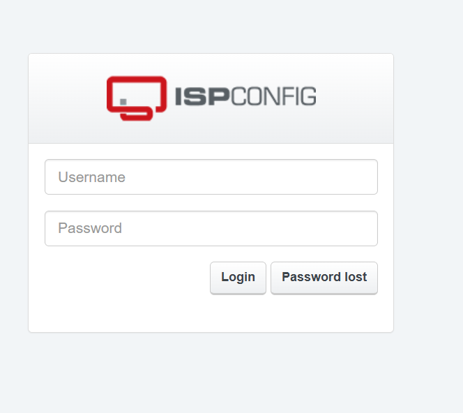

# http://192.168.110.101

- nmap

┌──(root㉿docker-desktop)-[/]
└─# nmap -sS -sV -sC -Pn -O -T4 --top-ports 2000 192.168.110.101
Starting Nmap 7.99 ( https://nmap.org ) at 2026-10-05 11:12 +0000
Warning: 192.168.110.101 giving up on port because retransmission cap hit (6).
Nmap scan report for 192.168.110.101
Host is up (0.070s latency).
Not shown: 1959 closed tcp ports (reset), 37 filtered tcp ports (no-response)
PORT     STATE SERVICE VERSION
22/tcp   open  ssh     OpenSSH 8.2p1 Ubuntu 4ubuntu0.11 (Ubuntu Linux; protocol 2.0)
| ssh-hostkey: 
|   3072 51:56:a7:34:16:8e:3d:47:17:c8:96:d5:e6:94:46:46 (RSA)
|   256 fe:76:e3:4c:2b:f6:f5:21:a2:4d:9f:59:52:39:b9:16 (ECDSA)
|_  256 2c:dd:62:7d:d6:1c:f4:fd:a1:e4:c8:aa:11:ae:d6:1f (ED25519)
80/tcp   open  http    Apache httpd
| http-title: ISPConfig
|_Requested resource was /login/
|_http-server-header: Apache
| http-robots.txt: 1 disallowed entry 
|_/
8080/tcp open  http    Apache httpd
|_http-title: Apache2 Ubuntu Default Page: It works
|_http-server-header: Apache
8081/tcp open  http    Apache httpd
|_http-title: 403 Forbidden
|_http-server-header: Apache
OS fingerprint not ideal because: Didn't receive UDP response. Please try again with -sSU
No OS matches for host
Service Info: OS: Linux; CPE: cpe:/o:linux:linux_kernel

OS and Service detection performed. Please report any incorrect results at https://nmap.org/submit/ .
Nmap done: 1 IP address (1 host up) scanned in 151.25 seconds

- ffuf path 

┌──(root㉿docker-desktop)-[/]
└─# ffuf -u http://192.168.110.101/FUZZ -w /usr/share/seclists/Discovery/Web-Content/raft-large-words.txt 

        /'___\  /'___\           /'___\       
       /\ \__/ /\ \__/  __  __  /\ \__/       
       \ \ ,__\\ \ ,__\/\ \/\ \ \ \ ,__\      
        \ \ \_/ \ \ \_/\ \ \_\ \ \ \ \_/      
         \ \_\   \ \_\  \ \____/  \ \_\       
          \/_/    \/_/   \/___/    \/_/       

       2.1.0-dev
________________________________________________

 :: Method           : GET
 :: URL              : http://192.168.110.101/FUZZ
 :: Wordlist         : FUZZ: /usr/share/seclists/Discovery/Web-Content/raft-large-words.txt
 :: Follow redirects : false
 :: Calibration      : false
 :: Timeout          : 10
 :: Threads          : 40
 :: Matcher          : Response status: 200-299,301,302,307,401,403,405,500
________________________________________________

login                   [Status: 301, Size: 237, Words: 14, Lines: 8, Duration: 115ms]
.php                    [Status: 403, Size: 199, Words: 14, Lines: 8, Duration: 115ms]
.html                   [Status: 403, Size: 199, Words: 14, Lines: 8, Duration: 112ms]
help                    [Status: 301, Size: 236, Words: 14, Lines: 8, Duration: 109ms]
temp                    [Status: 301, Size: 236, Words: 14, Lines: 8, Duration: 109ms]
sites                   [Status: 301, Size: 237, Words: 14, Lines: 8, Duration: 108ms]
tools                   [Status: 301, Size: 237, Words: 14, Lines: 8, Duration: 107ms]
mail                    [Status: 301, Size: 236, Words: 14, Lines: 8, Duration: 111ms]
javascript              [Status: 301, Size: 242, Words: 14, Lines: 8, Duration: 108ms]
.                       [Status: 302, Size: 0, Words: 1, Lines: 1, Duration: 117ms]
admin                   [Status: 301, Size: 237, Words: 14, Lines: 8, Duration: 3736ms]
.htaccess               [Status: 403, Size: 199, Words: 14, Lines: 8, Duration: 114ms]
client                  [Status: 301, Size: 238, Words: 14, Lines: 8, Duration: 110ms]
js                      [Status: 301, Size: 234, Words: 14, Lines: 8, Duration: 5740ms]
.htm                    [Status: 403, Size: 199, Words: 14, Lines: 8, Duration: 6729ms]
remote                  [Status: 301, Size: 238, Words: 14, Lines: 8, Duration: 144ms]
dashboard               [Status: 301, Size: 241, Words: 14, Lines: 8, Duration: 111ms]
themes                  [Status: 301, Size: 238, Words: 14, Lines: 8, Duration: 7742ms]
.phtml                  [Status: 403, Size: 199, Words: 14, Lines: 8, Duration: 106ms]
monitor                 [Status: 301, Size: 239, Words: 14, Lines: 8, Duration: 118ms]
.htc                    [Status: 403, Size: 199, Words: 14, Lines: 8, Duration: 107ms]
.html_var_DE            [Status: 403, Size: 199, Words: 14, Lines: 8, Duration: 116ms]
server-status           [Status: 403, Size: 199, Words: 14, Lines: 8, Duration: 107ms]
dns                     [Status: 301, Size: 235, Words: 14, Lines: 8, Duration: 113ms]
.htpasswd               [Status: 403, Size: 199, Words: 14, Lines: 8, Duration: 107ms]
vm                      [Status: 301, Size: 234, Words: 14, Lines: 8, Duration: 110ms]
.html.                  [Status: 403, Size: 199, Words: 14, Lines: 8, Duration: 108ms]
.html.html              [Status: 403, Size: 199, Words: 14, Lines: 8, Duration: 106ms]
.htpasswds              [Status: 403, Size: 199, Words: 14, Lines: 8, Duration: 108ms]
.htm.                   [Status: 403, Size: 199, Words: 14, Lines: 8, Duration: 114ms]
.htmll                  [Status: 403, Size: 199, Words: 14, Lines: 8, Duration: 109ms]
.phps                   [Status: 403, Size: 199, Words: 14, Lines: 8, Duration: 111ms]
.html.old               [Status: 403, Size: 199, Words: 14, Lines: 8, Duration: 114ms]
.ht                     [Status: 403, Size: 199, Words: 14, Lines: 8, Duration: 151ms]
.html.bak               [Status: 403, Size: 199, Words: 14, Lines: 8, Duration: 151ms]
.htm.htm                [Status: 403, Size: 199, Words: 14, Lines: 8, Duration: 161ms]
.hta                    [Status: 403, Size: 199, Words: 14, Lines: 8, Duration: 112ms]
.htgroup                [Status: 403, Size: 199, Words: 14, Lines: 8, Duration: 123ms]
.html1                  [Status: 403, Size: 199, Words: 14, Lines: 8, Duration: 123ms]
.html.printable         [Status: 403, Size: 199, Words: 14, Lines: 8, Duration: 122ms]
.html.LCK               [Status: 403, Size: 199, Words: 14, Lines: 8, Duration: 122ms]
.htm.LCK                [Status: 403, Size: 199, Words: 14, Lines: 8, Duration: 114ms]
.html.php               [Status: 403, Size: 199, Words: 14, Lines: 8, Duration: 134ms]
.htaccess.bak           [Status: 403, Size: 199, Words: 14, Lines: 8, Duration: 138ms]
.htx                    [Status: 403, Size: 199, Words: 14, Lines: 8, Duration: 139ms]
.htmls                  [Status: 403, Size: 199, Words: 14, Lines: 8, Duration: 139ms]
.htm2                   [Status: 403, Size: 199, Words: 14, Lines: 8, Duration: 110ms]
.htlm                   [Status: 403, Size: 199, Words: 14, Lines: 8, Duration: 110ms]
.html-                  [Status: 403, Size: 199, Words: 14, Lines: 8, Duration: 116ms]
.htuser                 [Status: 403, Size: 199, Words: 14, Lines: 8, Duration: 116ms]
.htm.old                [Status: 403, Size: 199, Words: 14, Lines: 8, Duration: 119ms]
.html_files             [Status: 403, Size: 199, Words: 14, Lines: 8, Duration: 119ms]
.htmlpar                [Status: 403, Size: 199, Words: 14, Lines: 8, Duration: 119ms]
.html-1                 [Status: 403, Size: 199, Words: 14, Lines: 8, Duration: 119ms]
.hts                    [Status: 403, Size: 199, Words: 14, Lines: 8, Duration: 119ms]
.htm.html               [Status: 403, Size: 199, Words: 14, Lines: 8, Duration: 119ms]
.htmlprint              [Status: 403, Size: 199, Words: 14, Lines: 8, Duration: 119ms]
.htm.d                  [Status: 403, Size: 199, Words: 14, Lines: 8, Duration: 119ms]
.html_                  [Status: 403, Size: 199, Words: 14, Lines: 8, Duration: 119ms]
.htacess                [Status: 403, Size: 199, Words: 14, Lines: 8, Duration: 119ms]
.html.sav               [Status: 403, Size: 199, Words: 14, Lines: 8, Duration: 119ms]
.html.orig              [Status: 403, Size: 199, Words: 14, Lines: 8, Duration: 119ms]
mailuser                [Status: 301, Size: 240, Words: 14, Lines: 8, Duration: 109ms]
.htm.rc                 [Status: 403, Size: 199, Words: 14, Lines: 8, Duration: 185ms]
.htm.bak                [Status: 403, Size: 199, Words: 14, Lines: 8, Duration: 185ms]
.htm3                   [Status: 403, Size: 199, Words: 14, Lines: 8, Duration: 185ms]
.htm7                   [Status: 403, Size: 199, Words: 14, Lines: 8, Duration: 174ms]
.html--                 [Status: 403, Size: 199, Words: 14, Lines: 8, Duration: 173ms]
.html-2                 [Status: 403, Size: 199, Words: 14, Lines: 8, Duration: 173ms]
.htaccess.old           [Status: 403, Size: 199, Words: 14, Lines: 8, Duration: 186ms]
.htm5                   [Status: 403, Size: 199, Words: 14, Lines: 8, Duration: 181ms]
.htm_                   [Status: 403, Size: 199, Words: 14, Lines: 8, Duration: 173ms]
.html.pdf               [Status: 403, Size: 199, Words: 14, Lines: 8, Duration: 170ms]
.html-c                 [Status: 403, Size: 199, Words: 14, Lines: 8, Duration: 173ms]
.html-0                 [Status: 403, Size: 199, Words: 14, Lines: 8, Duration: 173ms]
.htm8                   [Status: 403, Size: 199, Words: 14, Lines: 8, Duration: 174ms]
.html-p                 [Status: 403, Size: 199, Words: 14, Lines: 8, Duration: 173ms]
.html-old               [Status: 403, Size: 199, Words: 14, Lines: 8, Duration: 173ms]
.html.htm               [Status: 403, Size: 199, Words: 14, Lines: 8, Duration: 173ms]
.html.none              [Status: 403, Size: 199, Words: 14, Lines: 8, Duration: 171ms]
.html.images            [Status: 403, Size: 199, Words: 14, Lines: 8, Duration: 173ms]
.html5                  [Status: 403, Size: 199, Words: 14, Lines: 8, Duration: 171ms]
.html.start             [Status: 403, Size: 199, Words: 14, Lines: 8, Duration: 171ms]
.html.inc               [Status: 403, Size: 199, Words: 14, Lines: 8, Duration: 174ms]
.htmlc                  [Status: 403, Size: 199, Words: 14, Lines: 8, Duration: 171ms]
.htn                    [Status: 403, Size: 199, Words: 14, Lines: 8, Duration: 171ms]
.htmlfeed               [Status: 403, Size: 199, Words: 14, Lines: 8, Duration: 172ms]
.htmla                  [Status: 403, Size: 199, Words: 14, Lines: 8, Duration: 172ms]
.htmlq                  [Status: 403, Size: 199, Words: 14, Lines: 8, Duration: 172ms]
.html_old               [Status: 403, Size: 199, Words: 14, Lines: 8, Duration: 172ms]
.htmlBAK                [Status: 403, Size: 199, Words: 14, Lines: 8, Duration: 173ms]
.html.txt               [Status: 403, Size: 199, Words: 14, Lines: 8, Duration: 172ms]
.html4                  [Status: 403, Size: 199, Words: 14, Lines: 8, Duration: 173ms]
.htmlDolmetschen        [Status: 403, Size: 199, Words: 14, Lines: 8, Duration: 173ms]
.htmlu                  [Status: 403, Size: 199, Words: 14, Lines: 8, Duration: 172ms]
.html7                  [Status: 403, Size: 199, Words: 14, Lines: 8, Duration: 173ms]
:: Progress: [119600/119600] :: Job [1/1] :: 353 req/sec :: Duration: [0:06:54] :: Errors: 0 ::

- robots.txt -> X
┌──(root㉿docker-desktop)-[/]
└─# curl -s http://192.168.110.101/robots.txt
User-agent: *
Disallow: /

- subdomain scan -> X

┌──(root㉿docker-desktop)-[/]
└─# ffuf -u http://192.168.110.101 -H "host:FUZZ.192.168.110.101" -w /usr/share/seclists/Discovery/DNS/namelist.txt 

        /'___\  /'___\           /'___\       
       /\ \__/ /\ \__/  __  __  /\ \__/       
       \ \ ,__\\ \ ,__\/\ \/\ \ \ \ ,__\      
        \ \ \_/ \ \ \_/\ \ \_\ \ \ \ \_/      
         \ \_\   \ \_\  \ \____/  \ \_\       
          \/_/    \/_/   \/___/    \/_/       

       2.1.0-dev
________________________________________________

 :: Method           : GET
 :: URL              : http://192.168.110.101
 :: Wordlist         : FUZZ: /usr/share/seclists/Discovery/DNS/namelist.txt
 :: Header           : Host: FUZZ.192.168.110.101
 :: Follow redirects : false
 :: Calibration      : false
 :: Timeout          : 10
 :: Threads          : 40
 :: Matcher          : Response status: 200-299,301,302,307,401,403,405,500
________________________________________________

:: Progress: [151265/151265] :: Job [1/1] :: 14 req/sec :: Duration: [1:13:36] :: Errors: 1455 ::

